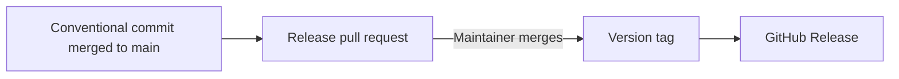

# Contributing

Thank you for contributing. Check existing issues before opening a new one, keep each
change focused, and never include credentials or other sensitive values in an issue or
pull request.

## Set up a local checkout

1. Fork the repository and clone your fork.
2. Add the canonical repository as the `upstream` remote.
3. Install the required tools:
   - Terraform 1.9.8 (the version used by CI)
   - terraform-docs 0.20.0
   - Checkov 3.3.22
   - Trivy
4. Install the repository hooks once per clone:

   ```bash
   sh .githooks/install.sh
   ```

   Do not install another hook manager over these hooks. The hooks enforce the
   commit-metadata policy and dispatch the configured local scanners.

Create a short-lived branch with a descriptive prefix such as `feature/`, `fix/`,
`docs/`, `refactor/`, or `test/`.

## Format and validate Terraform

Confirm that the selected binary is the same version as CI, then run the CI commands
from the repository root:

```bash
terraform version
terraform fmt -recursive -check -diff

for module in modules/*/; do
  (cd "$module" && terraform init -backend=false && terraform validate)
done
```

CI starts without module lock files. If local initialization created `.terraform/`
directories or module lock files, remove them before checking generated documentation.

## Generate module documentation

After changing a module input, output, or resource, regenerate that module's README
with terraform-docs 0.20.0. This is the inject operation enforced by CI:

```bash
terraform-docs markdown table --indent 2 --output-mode inject --output-file README.md \
  --output-template '<!-- BEGIN_TF_DOCS -->
{{ .Content }}
<!-- END_TF_DOCS -->' modules/<module>
```

Review the resulting diff and ensure a second run is idempotent.

## Run the compliance scan

CI pins Checkov 3.3.22. Install it with a suffix so the repository's optional local
hook does not accidentally pick up a differently configured executable:

```bash
pipx install --suffix=@3322 checkov==3.3.22
```

Run it with the same render setting and skip list that the validation workflow uses:

```bash
RENDER_EDGES_DUPLICATE_ITER_COUNT=50 checkov@3322 -d . --framework terraform --quiet \
  --skip-check "$(sed -n 's/^ *skip_check: *\([^[:space:]]*\).*/\1/p' .github/workflows/validate.yml)"
```

The skip list must remain sourced from the workflow rather than copied into another
configuration file. The local hook also runs Trivy at its configured severity:

```bash
trivy config . --severity CRITICAL --skip-dirs .terraform
```

## Verify changes without cloud credentials

Provider-backed plans require credentials, but expression behavior and plan structure
can be checked offline.

Use `terraform console` against the real module to inspect variables and locals. Keep
plugin data outside the checkout and supply required inputs through a temporary variable
file that is not committed:

```bash
export TF_DATA_DIR="$(mktemp -d)"
terraform -chdir=modules/wordpress-site init -backend=false
terraform -chdir=modules/wordpress-site console -var-file=<temporary-inputs-file>
```

Wrap expressions in `jsonencode()` when checking null values, because a bare null prints
as a blank line.

For changes that need a plan-level assertion, add a temporary `.tftest.hcl` fixture with
a `mock_provider` block and run:

```bash
terraform -chdir=modules/wordpress-site test -verbose
```

Mock-provider tests verify planned configuration without contacting the provider. Check
the command's exit code and assert specific resources and attributes so two identical
failures cannot be mistaken for a successful before-and-after comparison. Do not commit
temporary fixtures or generated initialization files unless they are part of the change.

## Commits and pull requests

Use Conventional Commits, for example:

```text
feat(storage): add an optional setting
fix(database): correct input validation
docs(readme): clarify an example
```

Open the pull request directly against `main`. **Do not stack pull requests.** A pull
request based on another feature branch does not run the complete validation workflow,
and squash-merging its base can leave later changes disconnected from `main`. Wait for
the current pull request to land, update from `main`, and then open the next one.

Before requesting review:

1. Run the format, validation, compliance, and documentation commands above.
2. Complete every applicable part of the pull request template, including documentation
   impact and offline verification.
3. Confirm that all required checks pass.
4. Request an independent review of diagrams and technical claims against the code.

## Releases

Releases are automated. A conventional commit merged to `main` causes the release
automation to open or update a release pull request. Merging that release pull request
updates the changelog and manifest, creates the version tag, and publishes the release.
Do not edit the changelog or create tags by hand.

- `fix:` produces a patch release.
- `feat:` produces a minor release.
- `feat!:` or a `BREAKING CHANGE:` footer produces a major release.
- `docs:` and `chore:` do not produce a release.



## Review guidance

Reviewers check readability, Terraform conventions, validation and test evidence,
documentation completeness, safe handling of sensitive values, and whether the change
introduces a documented compatibility impact. Prefer descriptive names, `for_each` when
resource identity matters, locals for derived values, and validation blocks for input
constraints.
