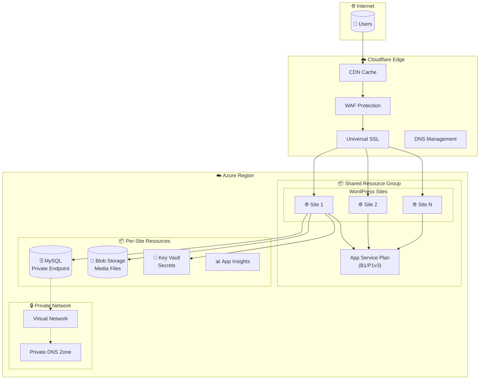
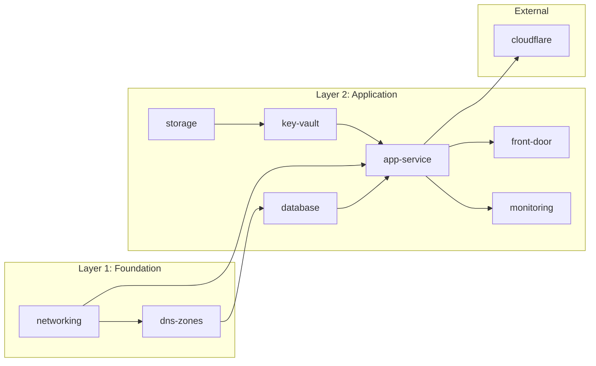
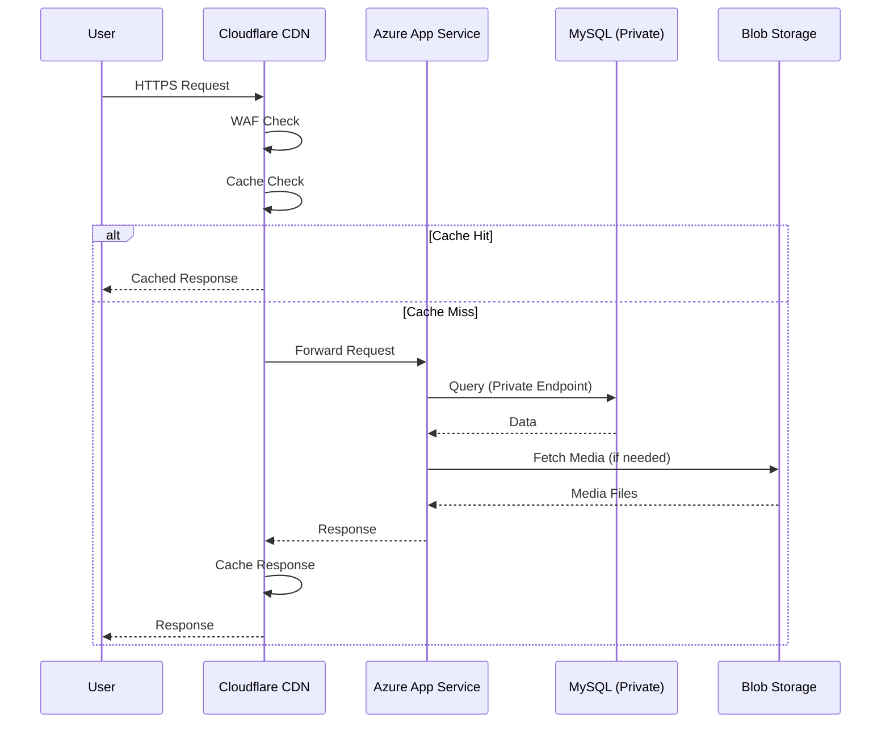
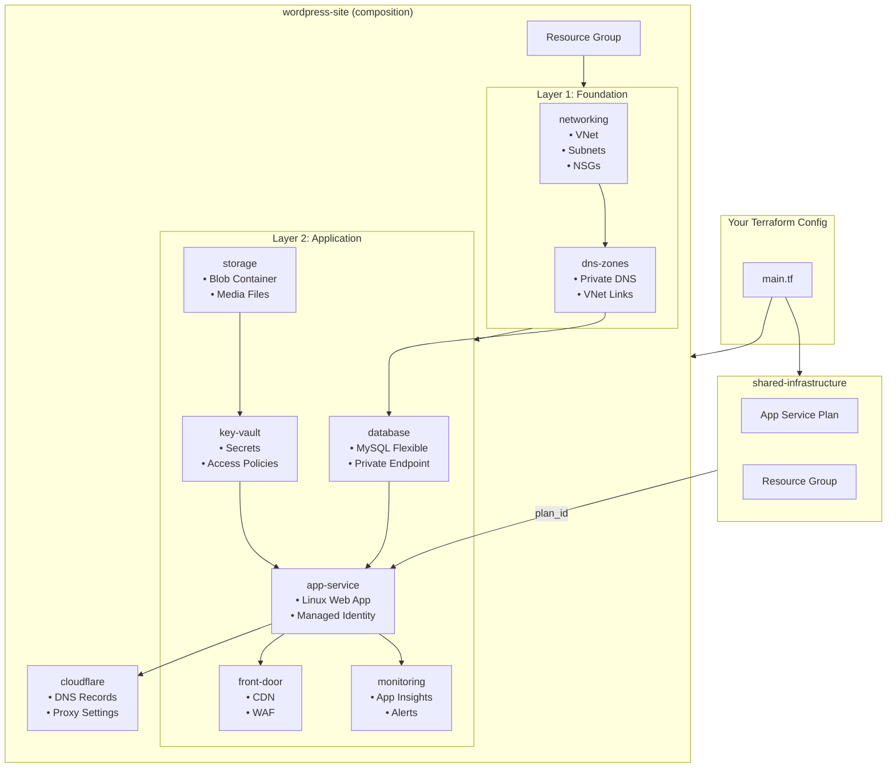

# Terraform Azure WordPress

Deploy production-ready WordPress sites on Azure with Cloudflare CDN using Terraform/OpenTofu.

## Features

- **Azure App Service** (Linux) with managed WordPress container
- **Staging Deployment Slots** with configurable app settings and always-on control
- **Azure MySQL Flexible Server** with Private Endpoint (secure database access)
- **Backup & Recovery** -- configurable PITR retention (1-35 days), geo-redundant backup, storage auto-grow
- **Azure Blob Storage** for media uploads (no Azure Files latency)
- **Blob Protection** -- versioning, soft-delete retention, additional containers (e.g., wp-backups)
- **Storage Lifecycle Management** -- auto-tier to Cool, version/snapshot cleanup on schedule
- **Cloudflare CDN** with DNS management and SSL (cost-optimized)
- **Azure Front Door** alternative with WAF (enterprise option)
- **Key Vault** for secrets management with managed identity (production + staging slots)
- **Application Insights** for monitoring and alerting
- **Shared App Service Plans** for multi-site cost optimization

## Architecture


```text
┌──────────────────────────────────────────────────────────────────┐
│                        Cloudflare Edge                           │
│  ┌────────────────────────────────────────────────────────────┐  │
│  │  CDN + WAF + SSL + DDoS Protection                         │  │
│  └────────────────────────────────────────────────────────────┘  │
└────────────────────────────────────────────────────────────────┘
                              │
┌─────────────────────────────┴────────────────────────────────────┐
│                        Azure Region                              │
│  ┌────────────────────────────────────────────────────────────┐  │
│  │           Shared Resource Group (per environment)          │  │
│  │  ┌──────────────────────────────────────────────────────┐  │  │
│  │  │            Shared App Service Plan                   │  │  │
│  │  │  ┌─────────────┐  ┌─────────────┐  ┌─────────────┐  │  │  │
│  │  │  │   Site 1    │  │   Site 2    │  │   Site N    │  │  │  │
│  │  │  │  WordPress  │  │  WordPress  │  │  WordPress  │  │  │  │
│  │  │  └─────────────┘  └─────────────┘  └─────────────┘  │  │  │
│  │  └──────────────────────────────────────────────────────┘  │  │
│  └────────────────────────────────────────────────────────────┘  │
│                                                                  │
│  ┌────────────────────────────────────────────────────────────┐  │
│  │           Per-Site Resources                               │  │
│  │  ┌──────────────┐ ┌──────────────┐ ┌──────────────────┐   │  │
│  │  │ MySQL Server │ │ Blob Storage │ │     Key Vault    │   │  │
│  │  │   (Private)  │ │   (Media)    │ │    (Secrets)     │   │  │
│  │  └──────────────┘ └──────────────┘ └──────────────────────┘  │
│  └────────────────────────────────────────────────────────────┘  │
└──────────────────────────────────────────────────────────────────┘
```

### Infrastructure Overview



### Module Dependency Flow



### Request Flow



## Quick Start

### Prerequisites

- [Terraform](https://www.terraform.io/downloads.html) >= 1.6.0 or [OpenTofu](https://opentofu.org/)
- Azure CLI with active subscription
- Cloudflare account with domain

### Basic Usage

```hcl
module "wordpress_site" {
  # Pin to a release version for stability - see Releases page for latest
  source = "github.com/agenticcodingops/azure-wordpress//modules/wordpress-site?ref=v1.1.0"

  project_name  = "myproject"
  site_name     = "blog"
  environment   = "nonprod"
  location      = "eastus"
  tenant_id     = data.azurerm_client_config.current.tenant_id
  custom_domain = "blog.example.com"

  cdn_provider = "cloudflare"
  cloudflare = {
    enabled    = true
    account_id = var.cloudflare_account_id
    domain     = "example.com"
    subdomain  = "blog"
  }

  # Backup container for UpdraftPlus (v1.1.0+)
  storage = {
    additional_containers = {
      "wp-backups" = { access_type = "private" }
    }
  }

  # Staging slot settings (v1.1.0+)
  app_service = {
    extra_app_settings             = { "WP_ENVIRONMENT_TYPE" = "production" }
    extra_sticky_app_setting_names = ["WP_ENVIRONMENT_TYPE"]
    staging_app_settings_override  = { "WP_ENVIRONMENT_TYPE" = "staging" }
  }
}
```

> **Version pinning:** Always use `?ref=v<VERSION>` to pin to a specific release. Check the [Releases](https://github.com/agenticcodingops/azure-wordpress/releases) page for the latest version. See [Versioning](#versioning) for upgrade guidance.

See [examples/](examples/) for complete configurations.

## Modules

| Module | Description |
|--------|-------------|
| [wordpress-site](modules/wordpress-site/) | Complete WordPress deployment composition |
| [shared-infrastructure](modules/shared-infrastructure/) | Shared App Service Plan for multi-site |
| [app-service](modules/app-service/) | Azure App Service for WordPress |
| [database](modules/database/) | Azure MySQL Flexible Server |
| [storage](modules/storage/) | Azure Blob Storage for media |
| [key-vault](modules/key-vault/) | Azure Key Vault for secrets |
| [networking](modules/networking/) | VNet and subnets |
| [dns-zones](modules/dns-zones/) | Private DNS zones |
| [cloudflare](modules/cloudflare/) | Cloudflare DNS and CDN |
| [front-door](modules/front-door/) | Azure Front Door CDN + WAF |
| [monitoring](modules/monitoring/) | Application Insights and alerts |

### Module Composition



## CDN Options

| Provider | Cost | WAF | SSL | Best For |
|----------|------|-----|-----|----------|
| `cloudflare` | Free tier available | Free | Universal SSL | Cost-optimized deployments |
| `azure_front_door` | ~$35/month base | Included (Premium) | Managed certs | Enterprise, compliance |
| `direct` | None | None | App Service cert | Dev/testing |

## Cost Optimization

### Shared App Service Plans

Deploy multiple WordPress sites on a single App Service Plan:

```hcl
module "shared" {
  source = "github.com/agenticcodingops/azure-wordpress//modules/shared-infrastructure?ref=v1.1.0"

  project_name       = "myproject"
  environment        = "nonprod"
  location           = "eastus"
  app_service_sku    = "B1"  # Start small, scale up as needed
}

module "site1" {
  source = "github.com/agenticcodingops/azure-wordpress//modules/wordpress-site?ref=v1.1.0"

  project_name = "myproject"
  site_name    = "site1"
  # ... other config ...

  app_service = {
    plan_id        = module.shared.app_service_plan_id
    use_shared_plan = true
  }
  shared_resource_group_name = module.shared.resource_group_name
  shared_plan_sku            = "B1"
}
```

**Cost Savings**: ~50% reduction by consolidating plans.

### SKU Recommendations

| Environment | App Service | MySQL | Estimated Cost |
|-------------|-------------|-------|----------------|
| Dev/Test | B1 (shared) | B_Standard_B2s | ~$40/month/site |
| Production | P1v3 (shared) | GP_Standard_D2ds_v4 | ~$150/month/site |

## Security

- **VNet Integration**: App Service connects to MySQL via private endpoint
- **Managed Identity**: No credentials stored in code
- **Key Vault References**: Secrets loaded at runtime
- **IP Restrictions**: Only Cloudflare IPs can reach origin (when enabled)
- **TLS 1.2**: Minimum version enforced everywhere

## Backup & Recovery

### MySQL Point-in-Time Recovery (PITR)

Configure via the `database` variable:

```hcl
database = {
  backup_retention_days     = 14                  # 1-35 days (default: 30 for production, 7 for nonprod)
  geo_redundant_backup      = true                # Cross-region backup (default: true for production)
  storage_auto_grow_enabled = true                # Auto-grow storage when capacity is low (default: true)
}
```

The composition module applies environment-aware defaults: production gets 30-day retention
with geo-redundant backup enabled automatically.

### Blob Storage Protection

Configure via the `storage` variable:

```hcl
storage = {
  versioning_enabled              = true          # Point-in-time recovery for blobs (default: true)
  blob_delete_retention_days      = 30            # Soft-delete for blobs (default: 30)
  container_delete_retention_days = 30            # Soft-delete for containers (default: 30)

  # Additional containers (e.g., for UpdraftPlus backup plugin)
  additional_containers = {
    "wp-backups" = { access_type = "private" }
  }
}
```

### Storage Lifecycle Management

Automatically tier and clean up old data to reduce costs:

```hcl
storage = {
  lifecycle_policy_enabled       = true           # Enable lifecycle rules (default: true)
  lifecycle_cool_tier_days       = 30             # Move to Cool tier after N days (default: 30)
  lifecycle_version_delete_days  = 90             # Delete old versions after N days (default: 90)
  lifecycle_snapshot_delete_days = 90             # Delete old snapshots after N days (default: 90)
  lifecycle_prefix_match         = ["uploads/"]   # Scope to specific prefixes (default: ["uploads/"])
}
```

## Staging Deployment Slots

The App Service module creates a staging deployment slot automatically on Standard (S\*)
and Premium (P\*) SKUs. Basic tier (B\*) does not support slots.

### Configuring Staging

```hcl
app_service = {
  sku_name = "P1v3"  # Must be Standard or Premium for slot support

  # Add custom app settings (merged with built-in WordPress settings)
  extra_app_settings = {
    "WP_ENVIRONMENT_TYPE" = "production"
  }

  # Mark settings as sticky (slot-specific, not swapped)
  extra_sticky_app_setting_names = ["WP_ENVIRONMENT_TYPE"]

  # Override settings on the staging slot
  staging_app_settings_override = {
    "WP_ENVIRONMENT_TYPE" = "staging"
  }

  # Save cost by not keeping staging always loaded
  staging_always_on = false
}
```

### Built-in Slot Behavior

The module automatically handles these -- do NOT duplicate them in `extra_app_settings`:

| Setting | Production Value | Staging Value | Sticky? |
|---------|-----------------|---------------|---------|
| `WP_HOME` | `https://{custom_domain}` | `https://app-{name}-staging.azurewebsites.net` | Yes |
| `WP_SITEURL` | `https://{custom_domain}` | `https://app-{name}-staging.azurewebsites.net` | Yes |
| `WP_DEBUG` | `false` | `true` | Yes |
| `DATABASE_*` | Key Vault reference | Same as production | No |
| `MICROSOFT_AZURE_*` | Key Vault reference | Same as production | No |

### Key Vault Access

Both production and staging slot managed identities are granted Key Vault `Get`/`List`
access automatically, so `@Microsoft.KeyVault(SecretUri=...)` references resolve on both slots.

## Requirements

| Name | Version |
|------|---------|
| terraform | >= 1.6.0 |
| azurerm | >= 4.0.0 |
| azapi | >= 1.12.0 |
| cloudflare | >= 4.0.0 |

## Versioning

This project uses [Semantic Versioning](https://semver.org/) with automated releases. All modules are versioned together as a single unit.

### Pinning to a Version

Always pin module references to a specific version tag to prevent unexpected changes:

```hcl
module "wordpress" {
  source = "github.com/agenticcodingops/azure-wordpress//modules/wordpress-site?ref=v1.1.0"
  # ...
}
```

Available versions are listed on the [Releases](https://github.com/agenticcodingops/azure-wordpress/releases) page.

### Upgrading Versions

1. Check the [CHANGELOG](CHANGELOG.md) for the target version
2. Look for **BREAKING CHANGES** — these require configuration updates
3. Update the `?ref=` tag in all module source URLs
4. Run `terraform init -upgrade` to fetch the new version
5. Run `terraform plan` to review changes before applying

### Version Guarantees

| Version Change | Guarantee |
|---|---|
| **PATCH** (v1.0.0 → v1.0.1) | Bug fixes only. No input/output changes. Safe to upgrade. |
| **MINOR** (v1.0.0 → v1.1.0) | New features with backward compatibility. Existing configs work unchanged. |
| **MAJOR** (v1.0.0 → v2.0.0) | Breaking changes. Review CHANGELOG and update your configuration. |

## Contributing

Contributions are welcome! Please read our [contributing guidelines](CONTRIBUTING.md) before submitting PRs.

## License

Apache License 2.0 - see [LICENSE](LICENSE) for details.
