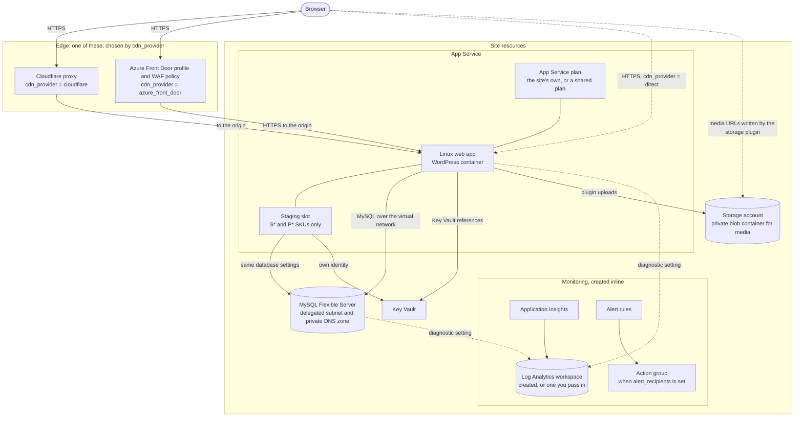
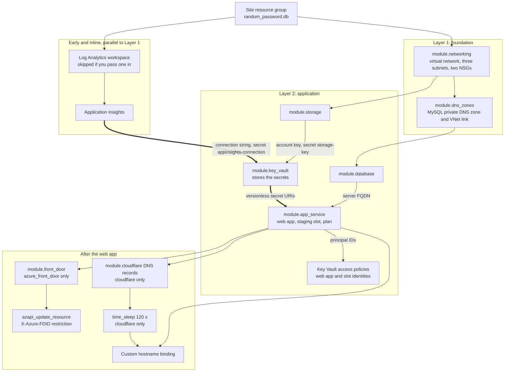
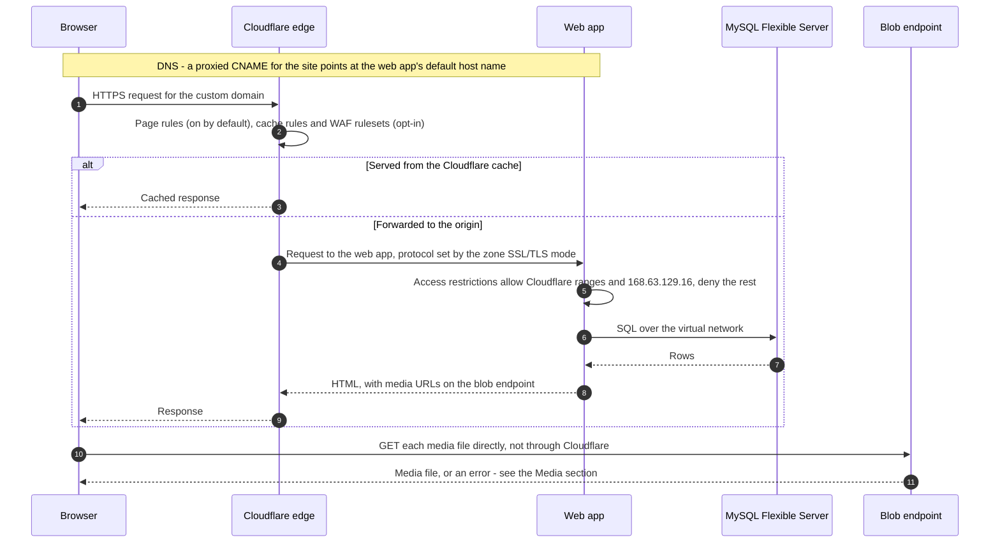
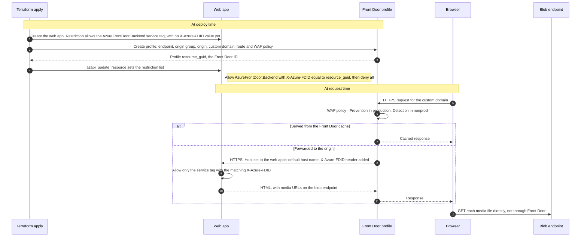
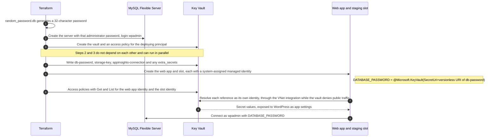
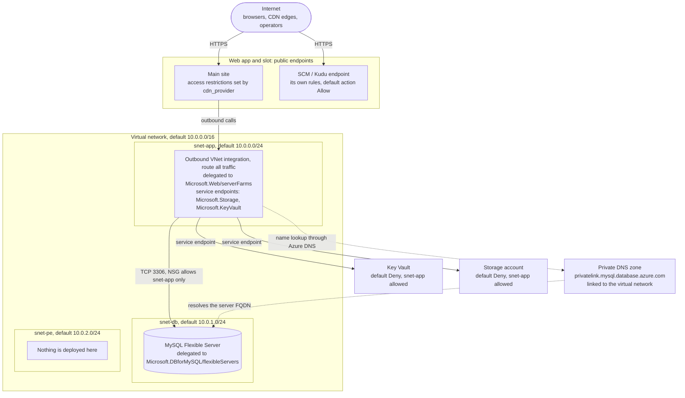
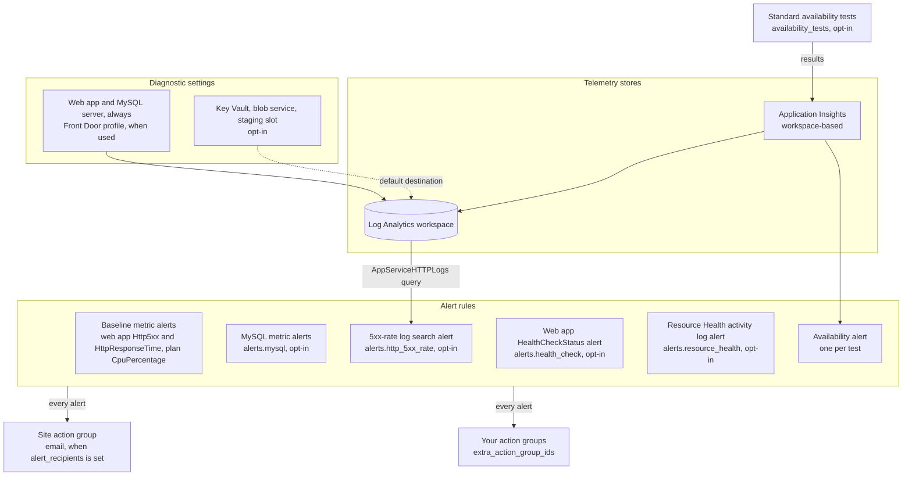

# Architecture

This page shows what one call to `modules/wordpress-site` deploys, the order Terraform creates it in, and how
requests, secrets and telemetry move between the parts. Read it before you choose a `cdn_provider` or change
network settings.

It describes release **v4.1.1**. Every section ends with its sources: file paths and line ranges at tag `v4.1.1`
(commit `9cf59db`), relative to the repository root. Line numbers can move in later releases. Where neither the
code nor Microsoft's documentation settles a question, the text says **UNKNOWN**.

- [At a glance](#at-a-glance)
- [Container view](#container-view)
- [Deployment order](#deployment-order)
- [Request flow: Cloudflare](#request-flow-cloudflare)
- [Request flow: Azure Front Door](#request-flow-azure-front-door)
- [Request flow: direct](#request-flow-direct)
- [Media](#media)
- [Secrets](#secrets)
- [Network](#network)
- [Monitoring](#monitoring)
- [Shared App Service plan](#shared-app-service-plan)
- [What the composition does not create](#what-the-composition-does-not-create)

## At a glance

- One call to `modules/wordpress-site` deploys one site.
- `cdn_provider` chooses the edge: `cloudflare`, `azure_front_door` or `direct`. The default is `direct`. Only one
  edge is created.
- WordPress runs as a Linux web app from the `mcr.microsoft.com/appsvc/wordpress-debian-php` image. A staging slot
  exists only on S\* and P\* SKUs.
- MySQL Flexible Server uses private access (virtual network integration): a delegated subnet and a private DNS
  zone. No module in this repository creates a private endpoint.
- Key Vault holds the database password, the storage account key and the Application Insights connection string.
  The web app reads them through Key Vault references, as its managed identity.
- Key Vault and Storage deny public data-plane access by default. The App Service subnet reaches both through
  service endpoints.
- With the storage plugin, media URLs point at the storage account's blob endpoint, so browsers fetch media from
  Azure directly, not through the CDN. That works only if the storage firewall and the container's access allow
  those requests, and the defaults do not. See [Media](#media).
- The composition creates Log Analytics and Application Insights itself. It never calls `modules/monitoring`.

Sources: `modules/wordpress-site/variables.tf:324-333` (`cdn_provider`), `modules/app-service/main.tf:24`,
`:194-197`, `:331-332`, `modules/database/main.tf:64-66`, `modules/wordpress-site/main.tf:260-282`, `:377-381`.

## Container view



What each part is:

| Part | Created by | Notes |
| --- | --- | --- |
| Cloudflare proxy | `modules/cloudflare`, only when `cdn_provider = "cloudflare"` and `cloudflare.enabled = true` | Reads an existing zone. It does not create one. |
| Front Door | `modules/front-door`, only when `cdn_provider = "azure_front_door"` and `front_door.enabled` is true (the default) | Premium SKU by default. |
| App Service plan | `modules/app-service`, unless you pass `plan_id` or `use_shared_plan = true` | Its own plan gets an autoscale setting of 1 to 5 instances. |
| Linux web app | `modules/app-service` | System-assigned managed identity. Outbound virtual network integration. |
| Staging slot | `modules/app-service`, only on S\* and P\* SKUs | Its own managed identity. The same database and storage settings as the web app. |
| MySQL Flexible Server | `modules/database` | One `wordpress` database. Administrator login `wpadmin`. |
| Key Vault | `modules/key-vault` | Access policies, not Azure RBAC. |
| Storage account | `modules/storage` | StorageV2 with a private `wp-uploads` container by default. |
| Log Analytics, Application Insights | `modules/wordpress-site` itself | The workspace is skipped when you pass `monitoring.log_analytics_workspace_id`. |
| Alert rules, action group | `modules/wordpress-site` itself | See [Monitoring](#monitoring). |

Everything lives in the site resource group `rg-PROJECT-SITE-SUFFIX`, where `SUFFIX` is `np` or `prod`, except in
one case. With
`use_shared_plan = true`, the web app and its slot live in the shared plan's resource group, because Azure needs a
web app and its plan in the same group.

Sources: `modules/wordpress-site/main.tf:79`, `:135`, `:141-142`, `:153`, `:185-188`, `:260-282`, `:291-327`, `:330-372`,
`:387-437`, `:452-528`, `:652-668`, `:775-797`, `:878-913`; `modules/app-service/main.tf:16`, `:139-152`,
`:155-181`, `:331-351`, `:436-440`, `:449-464`; `modules/database/main.tf:35-85`, `:120-126`;
`modules/key-vault/main.tf:29-68`; `modules/storage/main.tf:15-24`, `:88-92`; `modules/storage/variables.tf:110-114`;
`modules/front-door/main.tf:17-25`; `modules/cloudflare/main.tf:16-18`.

## Deployment order

The composition deploys in two layers, with explicit `depends_on` between them. Application Insights sits between
the layers.



**Why Application Insights comes first** (the bold arrows). The web app's `APPLICATIONINSIGHTS_CONNECTION_STRING`
setting is a Key Vault reference to the `appinsights-connection` secret. So the order is fixed:

1. Application Insights is created, and its connection string exists.
2. `module.key_vault` stores that connection string as a secret. It depends on `azurerm_application_insights.main`.
3. `module.app_service` gets the secret's URI. It depends on `module.key_vault`.

The composition creates the workspace and Application Insights itself, early, and its comments describe this as
breaking a circular dependency. It never calls the standalone `modules/monitoring`, which bundles Application
Insights with diagnostic settings and alerts that take the web app's ID as an input. The workspace and
Application Insights depend only on the resource group, so Terraform creates them in parallel with Layer 1.

**Why the Key Vault access policies come last.** The web app's managed identity exists only once the web app does.
`module.key_vault` therefore receives an all-zero placeholder principal, which skips its own app policy. The
composition then grants `Get` and `List` to the web app identity, and on S\* and P\* SKUs to the slot identity,
after `module.app_service` completes.

Other ordering facts, left out of the diagram:

- Every Layer 2 module also depends on `module.networking`. The password from `random_password.db` goes to both
  `module.database` and `module.key_vault`.
- Diagnostic settings and alerts follow the resource they watch. Availability tests wait for the hostname binding
  and, with Front Door, for `module.front_door`.
- `module.cloudflare` has no `depends_on`. Its DNS records wait for the web app through the default host name and
  domain verification ID they receive. Its zone lookup and rules do not wait.
- The hostname binding always waits for the web app. With Cloudflare it also waits for the DNS records and the
  120-second wait.
- The 120-second wait gives the `asuid` TXT record time to propagate before the hostname binding is created. It
  exists only with Cloudflare and a custom domain that is not an `azurewebsites.net` name.
- The management lock depends only on the resource group. A `CanNotDelete` lock makes Azure refuse every delete in
  the group, so remove it in an earlier apply before any change that replaces or removes a resource. See
  [Resource locks](../modules/wordpress-site/README.md#resource-locks).

Sources: `modules/wordpress-site/main.tf:1-12`, `:185-213`, `:221-251`, `:260-282`, `:291-327`, `:330-372`,
`:377-381`, `:387-437` (placeholder `:403`, `depends_on` `:432-436`), `:452-528` (`depends_on` `:522-527`),
`:531-568`, `:581-632`, `:775-797`, `:833-871`, `:878-913`, `:924-969`, `:1003-1016`;
`modules/wordpress-site/monitoring.tf:117`; `modules/app-service/main.tf:78`; `modules/key-vault/main.tf:72-84`;
`modules/monitoring/main.tf:43-54`, `:57-59`; `modules/monitoring/variables.tf:63-66`; `modules/wordpress-site/main.tf:253-257`, `:265`,
`:277`, `:947`, `:956-960`; site module README, [Resource locks](../modules/wordpress-site/README.md#resource-locks).

## Request flow: Cloudflare

With `cdn_provider = "cloudflare"`, `cloudflare.enabled = true` and `cloudflare.proxied = true` (the default), the
composition creates a proxied CNAME for the site that points at the web app's default host name.



What the code sets up for this flow:

- **DNS.** A `CNAME` for the subdomain (or `@` for the apex) points at the web app's default host name, proxied when
  `cloudflare.proxied` is true (the default). An apex site also gets a `www` CNAME. A TXT record `asuid.SUBDOMAIN`
  holds the web app's domain verification ID.
- **Hostname binding.** The composition binds the custom domain to the web app, after the 120-second wait. It binds
  no certificate: `ssl_state` and `thumbprint` are ignored.
- **Origin lock-down.** The web app and the slot allow Cloudflare's IPv4 and IPv6 ranges and `168.63.129.16/32`, and
  deny everything else. The composition reads the ranges live from `data.cloudflare_ip_ranges` on every run. The
  app-service module falls back to a built-in list only when it is called without them.
- **Origin protocol.** Cloudflare connects to the origin over HTTP or HTTPS, as the zone's SSL/TLS mode says. The
  module sets that mode only when `enable_zone_setting_overrides` is true (off by default), and the three page
  rules set `ssl = "strict"` for their own paths. The web app has `https_only = true`. Which mode an unmanaged zone
  uses, and whether strict mode validates against the web app with no custom-domain certificate bound, is UNKNOWN.
- **Edge rules.** Three page rules are on by default: bypass the cache for `wp-admin` and `wp-login.php`, and cache
  `wp-content`. Cache rules (`enable_cache_rules`), WAF rulesets (`enable_waf`, which needs the Pro plan or higher)
  and zone setting overrides are off by default.
- **`cloudflare.proxied = false` makes the site unreachable.** The CNAME becomes DNS-only, so browsers go straight
  to the web app. The web app's restrictions depend only on `cdn_provider`, so it still admits only Cloudflare's
  ranges and denies them.
- **`cloudflare.enabled` defaults to `false`.** With `cdn_provider = "cloudflare"` but `enabled = false`, the
  origin lock-down and the storage allow-list still apply, but no DNS record, wait or Cloudflare rule is created.
  The hostname binding is still created, so you must create the DNS records yourself.

Sources: `modules/wordpress-site/main.tf:52-54`, `:152-163`, `:504-508`, `:878-913`, `:924-969`;
`modules/wordpress-site/variables.tf:336-351`; `modules/cloudflare/main.tf:37-40`, `:48-87`, `:111-126`,
`:134-140`; `modules/cloudflare/variables.tf:68-72`; `modules/cloudflare/page-rules.tf:17-86` (`ssl` `:30`, `:57`, `:79`), `:97`; `modules/cloudflare/waf.tf:20`, `:83`, `:132`;
`modules/wordpress-site/main.tf:161`; `modules/app-service/main.tf:28-61`, `:165`, `:214-241`, `:258`, `:368-393`, `:414`.

## Request flow: Azure Front Door

With `cdn_provider = "azure_front_door"` (and `front_door.enabled`, which defaults to `true`), the composition
creates a Front Door profile and then narrows the web app's access restriction to that one profile. The restriction is patched after Front Door exists, because the web
app has to exist before Front Door can name it as an origin.



What the code sets up for this flow:

- **Profile and origin.** The origin is the web app's default host name, and the origin host header is the same
  name. The route forwards HTTPS only, redirects HTTP to HTTPS, and serves the custom domain with a Front Door
  managed certificate (minimum TLS 1.2).
- **The value injected is the profile's `resource_guid`,** which Microsoft calls the Front Door ID. It is not the
  ARM profile ID. Front Door adds it to every origin request as `X-Azure-FDID`. Microsoft recommends checking it,
  because other Azure customers' Front Door profiles use the same `AzureFrontDoor.Backend` addresses.
- **The patch replaces the whole list.** After it runs, the web app's main-site restrictions are exactly two rules:
  the Front Door allow rule and a deny-all rule. The `AllowAzureHealthProbe` rule that the app-service module
  declares is not in the patched list. The web app resource ignores changes only to one app setting, so a later
  `terraform plan` is expected to show an update that restores the module's own list: the health-probe rule, and
  no `X-Azure-FDID` value. This follows from the code but is untested here. Review the web app's plan in this mode
  before every apply.
- **The staging slot is not patched.** It allows the `AzureFrontDoor.Backend` service tag without an `X-Azure-FDID`
  check, so any Front Door profile can reach it.
- **`front_door.enabled = false`** with `cdn_provider = "azure_front_door"` creates no profile and no patch. The
  web app and the slot still allow the `AzureFrontDoor.Backend` service tag with no `X-Azure-FDID` check, and deny
  the rest.
- **WAF.** The policy uses Microsoft's Default Rule Set 2.1 and Bot Manager 1.1, with WordPress cookie exclusions.
  Rules 942230 and 941320 are set to log only. The mode is `Prevention` in production and `Detection` in nonprod
  unless you set `front_door.waf_mode`.
- **Caching rules are created but not attached.** The module creates a rule set with three rules: no cache for
  `wp-admin/` and `wp-login.php`, and cache overrides for static file extensions and `wp-content/uploads/`. The route
  does not list the rule set in `cdn_frontdoor_rule_set_ids`. Microsoft applies a rule set only to the routes it is
  associated with, so these rules do not act on requests. The route has its own `cache` block, which includes
  query strings in the cache key and turns compression on.
- **DNS is yours to create.** `module.cloudflare` runs only when `cdn_provider = "cloudflare"`, so this mode creates
  no DNS records. Use the outputs `front_door_endpoint_hostname` (the CNAME target) and
  `custom_domain_validation_token` (the `_dnsauth` TXT value).
- **The App Service hostname binding is still created** whenever the custom domain is not an `azurewebsites.net`
  name. Azure validates that binding against DNS for the custom domain. The composition does not output the web
  app's domain verification ID. Both examples in this repository use `cloudflare`, so whether this mode applies
  cleanly on a first deploy is UNKNOWN.

Sources: `modules/wordpress-site/main.tf:140-146`, `:501-502`, `:775-797`, `:833-871`, `:878-880`, `:942-969`;
`modules/wordpress-site/outputs.tf:146-164`; `modules/front-door/main.tf:17-201`, `:204-289` (route `:85-104`);
`modules/front-door/outputs.tf:14-17`; `modules/wordpress-site/variables.tf:311-321`;
`modules/app-service/main.tf:28`, `:244-258`, `:322-325`, `:395-414`;
`examples/basic-site/main.tf:109`; `examples/multi-site/main.tf:107`. Microsoft:
[Secure traffic to origins](https://learn.microsoft.com/azure/frontdoor/origin-security),
[What is a rule set?](https://learn.microsoft.com/azure/frontdoor/front-door-rules-engine).

## Request flow: direct

`cdn_provider = "direct"` is the default. Browsers reach the web app without a CDN.

- The main site and the slot allow all traffic (`ip_restriction_default_action = "Allow"`). The
  `168.63.129.16/32` allow rule is still declared.
- With a custom domain, the composition binds the host name but no certificate. You create the DNS records and
  bind a certificate outside this module.
- Media still comes from the blob endpoint. See [Media](#media).

Sources: `modules/wordpress-site/variables.tf:324-333`; `modules/wordpress-site/main.tf:942-969`;
`modules/app-service/main.tf:214-219`, `:258`, `:414`.

## Media

WordPress media is stored in Blob Storage, not on an Azure Files mount. The web app has no `storage_account` block.

1. **Configuration.** When `app_service_storage_plugin_app_settings_enabled` is `true` (the default), the web app
   and the slot get `MICROSOFT_AZURE_ACCOUNT_NAME`, `MICROSOFT_AZURE_CONTAINER` and `MICROSOFT_AZURE_ACCOUNT_KEY`.
   The key is a Key Vault reference to the `storage-key` secret. Only the Microsoft Azure Storage for WordPress
   plugin reads these settings. The container image does not, and this module does not install the plugin.
2. **Uploads.** The web app writes to the account through the App Service subnet, which carries the
   `Microsoft.Storage` service endpoint and is always on the account's allow-list.
3. **Reads.** The plugin rewrites media URLs to the account's own blob endpoint,
   `https://ACCOUNT.blob.core.windows.net/...`. Browsers therefore fetch media directly from Azure, not through
   Cloudflare or Front Door.
4. **The firewall is one gate.** `storage_network_rules_default_action` defaults to `Deny`, which returns 403 to those
   browsers. Set it to `Allow` when media is served from the blob endpoint. Keep `Deny` only if you front the blob
   endpoint with a CDN custom domain and allow-list that CDN's egress ranges. The container's access level is the
   other gate; see the UNKNOWN below.

With `cdn_provider = "cloudflare"`, Cloudflare's live IPv4 ranges are added to the account's allow-list. That
covers Cloudflare origin pulls only if you put the blob endpoint behind a Cloudflare custom domain, which this
module does not create. Cloudflare's IPv6 ranges are left out, because Azure Storage IP rules accept IPv4 only.

**UNKNOWN: how anonymous browser reads are authorised.** The uploads container is `private`, and the account sets
`allow_nested_items_to_be_public = false`. This repository does not configure how the plugin lets an anonymous
browser read a blob under those settings. Check it with your plugin version before you go live.

Sources: `modules/app-service/main.tf:120-128`, `:295-297`; `modules/wordpress-site/variables.tf:172-181`,
`:268-273`; `modules/wordpress-site/main.tf:357-366`; `modules/storage/main.tf:26-43`, `:88-92`;
`CHANGELOG.md:136-142` (v2.0.0 notes); `modules/storage/README.md:76-89`.

## Secrets



How it fits together:

- **One password, two consumers.** The same `random_password.db` result sets the MySQL administrator password and
  the `db-password` secret.
- **Module-owned secrets win.** The composition merges `extra_secrets` first and its own three secrets last, so a
  consumer entry cannot overwrite `db-password`, `storage-key` or `appinsights-connection`.
- **References are versionless.** Every reference uses the secret's versionless URI. Microsoft documents that App
  Service then uses the latest version and picks up a new one within 24 hours, or at once on a configuration change.
- **The database ignores later password changes.** The server has `ignore_changes = [administrator_password]`. A
  new value in the `db-password` secret does not change the password MySQL accepts.
- **The deploying principal** gets `Get`, `List`, `Set`, `Delete`, `Purge` and `Recover` on secrets. Its object ID
  comes from `deployer_object_id`, or from `data.azurerm_client_config` read outside the Key Vault module.
- **Network path.** The vault's `network_acls` default to `Deny`, with `bypass = "AzureServices"` and the App
  Service subnet on the allow-list. The web app routes all outbound traffic into the virtual network. Microsoft
  documents that App Service first tries the public route for Key Vault references, then the virtual network
  integration when the vault blocks public traffic. The vault's audit log may therefore show one 403 from the
  web app's public outbound IP, followed by a success from its private IP.
- **Terraform needs a network path too.** Terraform writes the secrets through the vault's data plane, from outside
  the virtual network. Allow the deploying address with `key_vault_network_acls_ip_rules`, or set
  `key_vault_public_network_access_enabled = true`.
- **Extra secrets as settings.** `extra_secret_app_settings` turns secret names into Key Vault references inside
  the module, and applies them to both the web app and the slot.

Sources: `modules/wordpress-site/main.tf:66-75`, `:209-213`, `:317-318`, `:377-381`, `:387-437`, `:443-446`,
`:480-492`, `:531-568`; `modules/wordpress-site/variables.tf:130-146`, `:808-822`;
`modules/database/main.tf:39-40`, `:76-84`; `modules/key-vault/main.tf:29-123` (`network_acls` `:54-59`, policies
`:72-101`, secrets `:105-123`); `modules/key-vault/outputs.tf:24-27`; `modules/app-service/main.tf:66-79`,
`:120-126`, `:179-181`, `:191`, `:287`, `:349-351`, `:436-440`. Microsoft:
[Use Key Vault references as app settings](https://learn.microsoft.com/azure/app-service/app-service-key-vault-references),
[Virtual network integration routes](https://learn.microsoft.com/azure/app-service/overview-vnet-integration#routes).

## Network



**Subnets.**

| Subnet | Default CIDR | Delegation | Service endpoints | NSG | Used by |
| --- | --- | --- | --- | --- | --- |
| `snet-app-SITE` | `10.0.0.0/24` | `Microsoft.Web/serverFarms` | `Microsoft.Storage`, `Microsoft.KeyVault` | `nsg-app-...` | Web app and slot (outbound) |
| `snet-db-SITE` | `10.0.1.0/24` | `Microsoft.DBforMySQL/flexibleServers` | none | `nsg-db-...` | MySQL Flexible Server |
| `snet-pe-SITE` | `10.0.2.0/24` | none | none | none | Nothing. Private endpoint network policies are disabled, but no module creates a private endpoint. |

Change the ranges through `networking = { vnet_address_space, app_subnet_cidr, db_subnet_cidr,
private_endpoint_subnet_cidr }`.

**MySQL is on a delegated subnet, not behind a private endpoint.** The server sets `delegated_subnet_id` and
`private_dns_zone_id`. Microsoft calls this private access (virtual network integration). A server deployed this way
cannot have a public endpoint. The web app finds it by its FQDN (`DATABASE_HOST`), through the private DNS zone
linked to the virtual network. The web app sets `WEBSITE_DNS_SERVER = 168.63.129.16`, Azure's DNS.

**MySQL does not require TLS.** The module sets the server parameter `require_secure_transport = OFF`. Its comment
says the Microsoft WordPress container does not configure TLS for MySQL by default. The connection runs over the
virtual network.

**Inbound filtering is the access restrictions, not the NSG.** The NSG on `snet-app` has inbound rules (allow 443
from `AzureFrontDoor.Backend` and `AppServiceManagement`, deny the rest). Microsoft documents that inbound NSG rules
on an integration subnet do not apply to the app, because virtual network integration is outbound only. What filters
inbound requests is the web app's access restriction list:

| `cdn_provider` | Main site allows | Default action |
| --- | --- | --- |
| `cloudflare` | `168.63.129.16/32`, Cloudflare IPv4 and IPv6 ranges | Deny |
| `azure_front_door` | `AzureFrontDoor.Backend` with the profile's `X-Azure-FDID`, after the patch | Deny |
| `direct` | `168.63.129.16/32` | Allow |

**The SCM (Kudu) endpoint is a separate gate.** The web app and the slot each have one. Their rules come from
`app_service_scm_ip_restrictions`, which is empty by default, and the default action is `Allow`. The network gate
and Kudu's authentication are independent, and both must pass. To restrict it, read
[Hardening the SCM/Kudu endpoint](../modules/wordpress-site/README.md#hardening-the-scmkudu-endpoint) first: a
`Deny` without an allow rule for your address also cuts off the Kudu SSH console.

**Outbound.** `vnet_route_all_enabled = true` sends all of the app's outbound traffic into the virtual network.
The module creates no NAT gateway or route table.

Sources: `modules/networking/main.tf:14-183` (app subnet `:27-52`, db subnet `:56-72`, PE subnet `:76-84`,
NSGs `:87-171`); `modules/dns-zones/main.tf:7-27`; `modules/database/main.tf:64-66`, `:91-96`;
`modules/wordpress-site/main.tf:173-178`, `:221-236`, `:357-366`, `:417-422`, `:513-517`, `:833-871`;
`modules/wordpress-site/variables.tf:218-254`, `:788-797`; `modules/app-service/main.tf:85`, `:176`, `:191`,
`:214-283`, `:416-432`; site module README,
[Hardening the SCM/Kudu endpoint](../modules/wordpress-site/README.md#hardening-the-scmkudu-endpoint). Microsoft:
[Integrate your app with an Azure virtual network](https://learn.microsoft.com/azure/app-service/overview-vnet-integration),
[Private network access for Azure Database for MySQL](https://learn.microsoft.com/azure/mysql/flexible-server/concepts-networking-vnet).

## Monitoring

The composition creates its own Log Analytics workspace (unless you pass `monitoring.log_analytics_workspace_id`)
and a workspace-based Application Insights component. It sets retention to 90 days in production and 30 in
nonprod, unless you set `monitoring.retention_days`, on the workspace it creates. It passes the same value to the
component's own `retention_in_days`. Microsoft documents that retention for workspace-based Application Insights is
set on the Log Analytics workspace. So when you pass your own workspace, set its retention yourself. Whether the
component's own setting then has any effect is UNKNOWN.



**Diagnostic settings.**

| Target | When | Logs | Metrics |
| --- | --- | --- | --- |
| Web app | Always | `AppServiceHTTPLogs`, `AppServiceConsoleLogs`, `AppServiceAppLogs`, `AppServicePlatformLogs` | `AllMetrics` |
| MySQL server | Always | `MySqlSlowLogs`, `MySqlAuditLogs` | `AllMetrics` |
| Front Door profile | `cdn_provider = "azure_front_door"` and `front_door.enabled` | `FrontDoorAccessLog`, `FrontDoorHealthProbeLog`, `FrontDoorWebApplicationFirewallLog` | `AllMetrics` |
| Key Vault | `key_vault_diagnostic_settings` is set | `AuditEvent` by default | `AllMetrics` by default |
| Blob service | `storage_blob_diagnostic_settings` is set | `StorageRead`, `StorageWrite`, `StorageDelete` by default | `Transaction` by default |
| Staging slot | `staging_slot_diagnostic_settings` is set, on S\* and P\* only | The four App Service categories by default | `AllMetrics` by default |

The three opt-in targets send to the site workspace unless an entry names another destination: a workspace, a
storage account, an event hub or a partner solution. `MySqlSlowLogs` carries rows only when
`database.slow_query_log_enabled = true`.

**Alert routing.** Every alert notifies the site action group and every entry in `extra_action_group_ids`. The site
action group exists only when `alert_recipients` is non-empty, and has one email receiver per address.

- The three baseline alerts exist whenever a route exists: `alert_recipients` or `extra_action_group_ids`.
- The opt-in families, and the availability alerts, fail the plan if you enable them with no route.
- The 5xx-rate alert queries `AppServiceHTTPLogs` in the workspace. It counts only the production app, and drops
  requests to the app's Kudu host, and requests to any `/AppServiceTunnel/` path.
- The Resource Health alert watches the web app, MySQL server, Key Vault and storage account, plus the plan when the
  site owns it.
- Availability tests are Standard tests. Classic URL ping tests are never created.

**Application telemetry.** The web app receives the Application Insights connection string as a Key Vault
reference. PHP on App Service has no automatic Application Insights instrumentation, so request telemetry arrives
only if WordPress runs an SDK. Azure also creates a "Failure Anomalies" rule next to the component, outside
Terraform; see
[Failure Anomalies](../modules/wordpress-site/README.md#failure-anomalies-platform-created).

For thresholds and examples, see [Alerting](../modules/wordpress-site/README.md#alerting) and
[Diagnostic settings](../modules/wordpress-site/README.md#diagnostic-settings) in the site module README.

Sources: `modules/wordpress-site/main.tf:166-170`, `:181`, `:201-204`, `:260-282`, `:576-632`, `:642-772`,
`:800-826`; `modules/wordpress-site/monitoring.tf:20-37`, `:41`, `:44-146`, `:152-274`, `:282-344`, `:351-380`,
`:386-426`, `:433-658`; `modules/wordpress-site/variables.tf:360-496`; `modules/app-service/main.tf:78`;
site module README, [Failure Anomalies](../modules/wordpress-site/README.md#failure-anomalies-platform-created).
Microsoft:
[Set the data retention](https://learn.microsoft.com/azure/azure-monitor/app/create-workspace-resource#set-the-data-retention).

## Shared App Service plan

Several sites can share one plan. `modules/shared-infrastructure` creates a resource group and a Linux plan, plus
an autoscale setting when `enable_autoscale` is true and a lock when `lock` is set. Each site then sets:

```hcl
app_service = {
  plan_id         = module.shared.app_service_plan_id
  use_shared_plan = true
}
shared_resource_group_name = module.shared.resource_group_name
shared_plan_sku            = "B1"
```

What changes for that site:

- The web app and slot are created in the shared resource group. Everything else stays in the site resource group.
- The site creates no plan and no autoscale setting of its own.
- `shared_plan_sku` decides whether a staging slot exists, so set it to the shared plan's real SKU.
- The Resource Health alert leaves the shared plan out.

Sources: `modules/shared-infrastructure/main.tf:43-71`, `:160-167`; `modules/wordpress-site/main.tf:121-135`, `:459`;
`modules/wordpress-site/monitoring.tf:390`, `:403-406`; `modules/app-service/main.tf:16-17`, `:140`, `:450`.

## What the composition does not create

- **Private endpoints.** No module creates an `azurerm_private_endpoint`. The `snet-pe` subnet is created and left
  empty.
- **`modules/monitoring`.** The composition never calls it. Changes there do not affect `wordpress-site`.
- **A Cloudflare zone.** `modules/cloudflare` reads an existing zone by name.
- **DNS records with Front Door or direct.** `module.cloudflare` runs only with `cdn_provider = "cloudflare"` and
  `cloudflare.enabled = true`.
- **A certificate for the custom domain on App Service.** The hostname binding ignores `ssl_state` and
  `thumbprint`.
- **The storage plugin.** The module sets its app settings but does not install it.
- **A NAT gateway or route table.** Outbound traffic uses the platform defaults.

Sources: `modules/networking/main.tf:76-84`; `modules/cloudflare/main.tf:16-26`;
`modules/wordpress-site/main.tf:153`, `:878-880`, `:962-965`; `modules/app-service/main.tf:120-126`.
