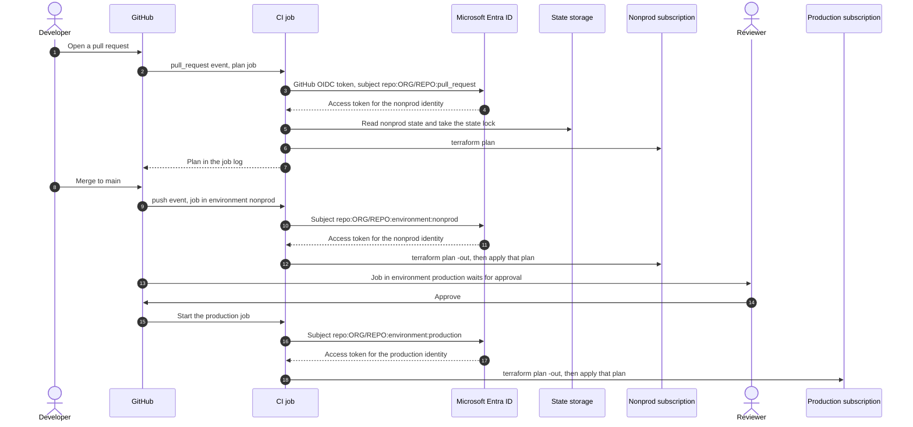
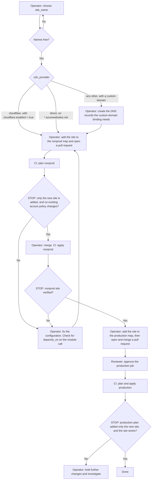

# Deployment guide

## Purpose

Run this module the way a consumer should in production:

- state is held remotely;
- CI signs in to Azure with OIDC, so it stores no secret;
- provider versions are pinned and locked;
- every change is planned on a pull request, applied to nonprod from `main`, and applied to production only after
  a reviewer approves.

The guide also covers what the module needs from its caller: the deployer-ID inputs, no `depends_on` on the
module call, resource locks, staging slots, shared plans, and adding and removing sites.

Code references are `file:line` at commit
[`9cf59db`](https://github.com/agenticcodingops/azure-wordpress/tree/9cf59dbf1f984a2e043cd7b6180187dda8cfcd5a),
which is release v4.1.1. Every name, ID and host name below is a placeholder.

## When to use

- You are moving from [getting started](getting-started.md) to a real deployment.
- You are adding or removing a site.
- You are reviewing an existing pipeline against the module's requirements.

## Prerequisites

- **Azure:** Owner, or Contributor plus User Access Administrator, on the subscriptions you deploy to. You need
  this once, to create the role assignments in steps 2 and 9.
- **Separate subscriptions** for nonprod and production are recommended, so that each CI identity can be scoped
  to one.
- **GitHub:** admin rights on the repository, to create environments and their protection rules. The steps use
  GitHub Actions. Other CI systems work the same way, with their own OIDC issuer and subject.
- **A GitHub plan that offers environment protection rules for your repository.** On GitHub Free, Pro and Team,
  required reviewers work only in public repositories. Deployment branch rules work in public repositories, and in
  private ones on Pro and Team
  ([GitHub docs](https://docs.github.com/en/actions/reference/workflows-and-actions/deployments-and-environments)).
  Without them, the production job does not wait for anyone. See step 2 for what that means.
- **Resource providers.** The module's resources live in these namespaces: `Microsoft.Web`,
  `Microsoft.DBforMySQL`, `Microsoft.KeyVault`, `Microsoft.Storage`, `Microsoft.Network`,
  `Microsoft.OperationalInsights` and `Microsoft.Insights`, plus `Microsoft.Cdn` for Front Door. With
  `resource_provider_registrations = "legacy"` the azurerm provider registers its 4.x set automatically. With
  `none` (the 5.x default) register them once by hand, for example
  `az provider register --namespace Microsoft.DBforMySQL --wait`.

## How the pipeline runs



Only a job in the `production` environment can get a production token. The production identity trusts that one
subject, and GitHub holds the job until a required reviewer approves it. That pause needs a repository and plan
where required reviewers are available (see Prerequisites).

## Steps

### Step 1: Create the state store

**Who:** Azure administrator. **STOP:** no.

Terraform state for this module holds secrets in plain text: the generated database password
(`modules/wordpress-site/main.tf:209-213`), the storage account key and the Application Insights connection string
(`modules/wordpress-site/main.tf:377-381`). Terraform's own documentation warns that state can contain sensitive
data. Protect the state account like the secrets it holds.

```bash
az group create --name rg-tfstate-example --location eastus

az storage account create --name sttfstateexample --resource-group rg-tfstate-example \
  --location eastus --sku Standard_LRS --kind StorageV2 --min-tls-version TLS1_2 \
  --allow-blob-public-access false --allow-shared-key-access false

az storage account blob-service-properties update --account-name sttfstateexample \
  --resource-group rg-tfstate-example --enable-versioning true \
  --enable-delete-retention true --delete-retention-days 30

az storage container-rm create --storage-account sttfstateexample --name tfstate-nonprod \
  --resource-group rg-tfstate-example

az storage container-rm create --storage-account sttfstateexample --name tfstate-production \
  --resource-group rg-tfstate-example
```

- **Shared keys off.** Turning off shared-key access means only Microsoft Entra identities can read the state.
  The backend then needs `use_azuread_auth = true`, in `backend.hcl` or as `ARM_USE_AZUREAD=true`. The
  `backend.hcl` in [getting started](getting-started.md#the-configuration) sets it.
- **Versioning and soft delete** let you recover an earlier state file after a bad write.
- **Locking.** The `azurerm` backend locks state with Azure Blob Storage's own mechanisms, so two jobs cannot
  write the same state at once.
- **One container per environment.** Pull-request plans run the pull request's code as the nonprod identity
  (step 2). If both environments shared a container, that code could download production state, with its secrets.
  Step 2 gives each identity a data role on its own container only.
- **Keep the state account out of reach of the CI identities.** Put it in a subscription or resource group where
  neither identity holds Contributor. Contributor can turn shared-key access back on and list the account keys,
  which would bypass the container-scoped roles.

### Step 2: Create the CI identities

**Who:** Azure administrator. **STOP:** yes. Check each subject string before you save it: it decides who can
deploy.

Create one identity per environment. A user-assigned managed identity is shown here; an app registration works
the same way.

```bash
az group create --name rg-identities-example --location eastus

az identity create --name id-wordpress-nonprod --resource-group rg-identities-example --location eastus

az identity federated-credential create --name github-pull-request \
  --identity-name id-wordpress-nonprod --resource-group rg-identities-example \
  --issuer https://token.actions.githubusercontent.com \
  --subject repo:ORG/REPO:pull_request --audiences api://AzureADTokenExchange

az identity federated-credential create --name github-env-nonprod \
  --identity-name id-wordpress-nonprod --resource-group rg-identities-example \
  --issuer https://token.actions.githubusercontent.com \
  --subject repo:ORG/REPO:environment:nonprod --audiences api://AzureADTokenExchange
```

Create `id-wordpress-production` the same way, with **one** federated credential, for
`repo:ORG/REPO:environment:production`.

Then assign each identity its roles. For the nonprod identity:

```bash
principal_id=$(az identity show --name id-wordpress-nonprod --resource-group rg-identities-example \
  --query principalId -o tsv)

az role assignment create --assignee-object-id "$principal_id" --assignee-principal-type ServicePrincipal \
  --role Contributor --scope /subscriptions/<nonprod-subscription-id>

az role assignment create --assignee-object-id "$principal_id" --assignee-principal-type ServicePrincipal \
  --role "Storage Blob Data Owner" \
  --scope /subscriptions/<state-subscription-id>/resourceGroups/rg-tfstate-example/providers/Microsoft.Storage/storageAccounts/sttfstateexample/blobServices/default/containers/tfstate-nonprod
```

Repeat for the production identity, with the production subscription and the `tfstate-production` container.

| Identity | Federated subjects | Azure roles |
|---|---|---|
| nonprod | `repo:ORG/REPO:pull_request`, `repo:ORG/REPO:environment:nonprod` | Contributor on the nonprod subscription; a data-plane role on the `tfstate-nonprod` container only |
| production | `repo:ORG/REPO:environment:production` | Contributor on the production subscription; a data-plane role on the `tfstate-production` container only; lock permission if you use locks (step 9) |

- **Subjects.** When a GitHub job references an environment, the token's subject is
  `repo:ORG/REPO:environment:NAME`, not the branch. A pull-request job's subject is `repo:ORG/REPO:pull_request`.
- **Pull-request plans run the pull request's code** with the nonprod identity. Anyone who can open a pull request
  in the repository can act as that identity during the plan. Keep it scoped to nonprod.
- **State role.** The command above follows Terraform 1.9's backend documentation, which asks for Storage Blob Data
  Owner when you use Entra ID authentication. The current documentation recommends Storage Blob Data Contributor on
  the container. If you run a newer Terraform, use the role its documentation names.
- **Contributor is enough to deploy** because the module creates no role assignments. It is not enough for locks
  (step 9).
- **Key Vault.** The deploying identity writes secrets through the vault's data plane, so the vault's firewall must
  let the runner in. See [the two network inputs](getting-started.md#the-two-network-inputs).

In GitHub, create the environments `nonprod` and `production`. On `production`:

- add **required reviewers**;
- under **deployment branches and tags**, allow only `main`, so that a job from another branch cannot use the
  environment.

**If your plan does not offer these rules for this repository** (for example, a private repository on GitHub
Free), the environment pauses nothing. Any workflow that names `production`, from any branch, then gets a token
with the production subject. Treat write access to the repository as production access, or move the repository to
a plan that offers the rules.

Store the client IDs, tenant ID and subscription IDs as **repository** variables. They are not secrets.

- **Not as environment variables.** GitHub makes an environment's variables available only to jobs that reference
  that environment
  ([GitHub docs](https://docs.github.com/en/actions/reference/workflows-and-actions/deployments-and-environments)).
- **Why that breaks the pull-request plan.** The plan job references no environment, so it could not read them.
  Adding an environment to that job would change its token subject away from `repo:ORG/REPO:pull_request`.

### Step 3: Pin providers exactly and commit the lock file

**Who:** operator. **STOP:** no.

The module sets ranges, not exact versions: azurerm `~> 5.6`, azapi `>= 1.13.0, < 3.0`, random `>= 3.5.0, < 4.0`,
cloudflare `~> 5.0` and time `>= 0.9.0, < 1.0` (`modules/wordpress-site/main.tf:17-46`), and null
`>= 3.2.0, < 4.0` (`modules/database/versions.tf:14-17`). Your root configuration fixes the exact versions.

```hcl
terraform {
  required_version = "1.9.8"

  required_providers {
    azurerm = {
      source  = "hashicorp/azurerm"
      version = "5.8.0" # an exact version inside the module's ~> 5.6
    }
  }
}

module "wordpress_sites" {
  # A release tag. For an immutable reference, use the tag's commit SHA instead.
  source = "github.com/agenticcodingops/azure-wordpress//modules/wordpress-site?ref=v4.1.1"
  # ...
}
```

Then generate the lock file with hashes for every platform that runs Terraform, and commit it:

```bash
terraform init -backend=false
terraform providers lock -platform=linux_amd64 -platform=darwin_arm64 -platform=darwin_amd64 -platform=windows_amd64
git add .terraform.lock.hcl
```

- **The lock file fixes all six providers,** including the ones only the module declares. On 2026-10-03 a fresh
  `init` against v4.1.1 selected azurerm 5.8.0, azapi 2.13.0, cloudflare 5.26.0, null 3.3.2, random 3.9.1 and
  time 0.14.2.
- **CI runs `terraform init` without `-upgrade`,** so it installs exactly what the lock file records.
- **Upgrade in a pull request:** change the pin, run `terraform init -upgrade` and the `providers lock` command
  again, and review the plan.
- This module's own repository does not commit a lock file (`.gitignore:16`), because it is a library. Your root
  configuration is not.

### Step 4: Lay out one root configuration per environment

**Who:** operator. **STOP:** no.

```text
infra/
  nonprod/
    main.tf               # module calls with environment = "nonprod"
    backend.hcl           # container_name = "tfstate-nonprod"
    .terraform.lock.hcl
  production/
    main.tf               # module calls with environment = "production"
    backend.hcl           # container_name = "tfstate-production"
    .terraform.lock.hcl
```

- **One `for_each` over a map of sites** in each environment, as in
  [`examples/multi-site/main.tf`](../examples/multi-site/main.tf) (`examples/multi-site/main.tf:64-74`).
- **Promote a module upgrade** by changing the `?ref=` in `nonprod/` first, and in `production/` in a later pull
  request.
- **Provider configuration.** With the OIDC variables from step 5, `provider "azurerm" { features {} }` needs no
  other arguments: azurerm reads `ARM_SUBSCRIPTION_ID`, `ARM_CLIENT_ID`, `ARM_TENANT_ID` and `ARM_USE_OIDC`. The
  `azapi` provider reads the same variables, which matters when `cdn_provider = "azure_front_door"`.

### Step 5: Write the pipeline

**Who:** operator. **STOP:** yes. Have a second person review the workflow before it can reach production.

A GitHub Actions sketch of the diagram above. Pin each action to a full commit SHA.

```yaml
name: infrastructure

on:
  pull_request:
    branches: [main]
  push:
    branches: [main]

permissions:
  contents: read
  id-token: write # lets each job request a GitHub OIDC token

env:
  ARM_USE_OIDC: "true"
  ARM_USE_AZUREAD: "true"
  ARM_TENANT_ID: ${{ vars.AZURE_TENANT_ID }}

jobs:
  plan-nonprod:
    if: github.event_name == 'pull_request'
    runs-on: ubuntu-latest
    env:
      ARM_CLIENT_ID: ${{ vars.NONPROD_CLIENT_ID }}
      ARM_SUBSCRIPTION_ID: ${{ vars.NONPROD_SUBSCRIPTION_ID }}
    defaults:
      run:
        working-directory: infra/nonprod
    steps:
      - uses: actions/checkout@<commit-sha>
      - uses: hashicorp/setup-terraform@<commit-sha>
        with:
          terraform_version: 1.9.8
      - run: terraform init -input=false -backend-config=backend.hcl
      - run: terraform plan -input=false -lock-timeout=10m

  apply-nonprod:
    if: github.event_name == 'push'
    runs-on: ubuntu-latest
    environment: nonprod
    concurrency: nonprod
    env:
      ARM_CLIENT_ID: ${{ vars.NONPROD_CLIENT_ID }}
      ARM_SUBSCRIPTION_ID: ${{ vars.NONPROD_SUBSCRIPTION_ID }}
    defaults:
      run:
        working-directory: infra/nonprod
    steps:
      - uses: actions/checkout@<commit-sha>
      - uses: hashicorp/setup-terraform@<commit-sha>
        with:
          terraform_version: 1.9.8
      - run: terraform init -input=false -backend-config=backend.hcl
      - run: terraform plan -input=false -lock-timeout=10m -out=tfplan
      - run: terraform apply -input=false tfplan

  apply-production:
    needs: apply-nonprod
    runs-on: ubuntu-latest
    environment: production # waits for a required reviewer
    concurrency: production
    env:
      ARM_CLIENT_ID: ${{ vars.PRODUCTION_CLIENT_ID }}
      ARM_SUBSCRIPTION_ID: ${{ vars.PRODUCTION_SUBSCRIPTION_ID }}
    defaults:
      run:
        working-directory: infra/production
    steps:
      - uses: actions/checkout@<commit-sha>
      - uses: hashicorp/setup-terraform@<commit-sha>
        with:
          terraform_version: 1.9.8
      - run: terraform init -input=false -backend-config=backend.hcl
      - run: terraform plan -input=false -lock-timeout=10m -out=tfplan
      - run: terraform apply -input=false tfplan
```

- **What reviewers see.** Each pull request shows the nonprod plan, and the nonprod apply runs before the
  production job. The production job plans and applies after its approval, so the reviewer approves before the
  production plan exists. The nonprod plan shows what the module creates for a change, but not production's
  values: production resolves different defaults for the MySQL SKU, backups, Key Vault purge protection and
  retention, and log retention (`modules/wordpress-site/main.tf:97-116`, `:168`).
- **If reviewers must read the production plan first,** split `apply-production` into a plan job and a gated
  job that applies the saved plan. A saved plan file can contain the same secrets as the state. Anyone who is
  signed in to GitHub and can read the repository can download a workflow artifact, so do not pass the plan
  file as an artifact in a public repository.
- **`concurrency`** runs one job per environment at a time, so two applies never compete for the state lock.
  A newer pending run replaces an older pending one; the newer run applies `main` as it is then.

### Step 6: Decide whether to set the deployer-ID inputs

**Who:** operator. **STOP:** yes, when you change the value on an existing site.

The module gives the identity that runs Terraform an access policy on each site's Key Vault, so that it can write
the secrets (`modules/key-vault/main.tf:87-101`). By default the module reads that identity itself, with
`data "azurerm_client_config"` (`modules/wordpress-site/main.tf:66`, `:73-74`).

That read returns **whoever runs the plan**. If plan and apply run as different identities, for example a
separate identity that plans pull requests, the plan shows the Terraform access policy being replaced. The
planning identity also needs `Get` and `List` on each vault's secrets, granted outside the module, or the refresh
fails: the module gives secret access only to the deployer and the app identities
(`modules/key-vault/main.tf:70-101`, `modules/wordpress-site/main.tf:530-568`).

Set `deployer_object_id` and `deployer_tenant_id` when either of these is true
(`modules/wordpress-site/variables.tf:46-66`):

- plan and apply run as different identities;
- you must put your own `depends_on` on the module call. Avoid that anyway: see step 7.

In the pipeline above, each environment plans and applies as one identity, so you do not need them. If you set
them:

- **Set both, or neither.** A precondition fails the plan otherwise (`modules/wordpress-site/main.tf:193-196`).
- **Use the apply identity's object ID,** in lower case. Validation rejects upper case
  (`modules/wordpress-site/variables.tf:51-54`, `:62-65`).

  ```bash
  az identity show --name id-wordpress-production --resource-group rg-identities-example --query principalId -o tsv
  # or, for an app registration:
  az ad sp show --id <client-id> --query id -o tsv
  ```

- **The policy's `object_id` forces replacement.** A value that differs from the identity that created the existing
  policy replaces the policy. Do that only as a planned identity change.

### Step 7: Keep `depends_on` off the module call

**Who:** operator. **STOP:** no.

Never write `depends_on` on a `module "..."` block that calls `wordpress-site`.

Terraform defers every data source inside a module that has `depends_on` until apply, whenever any of the
`depends_on` targets has a pending change. Two things then break:

- **The Key Vault access policy.** The deployer read becomes unknown, and the plan replaces the Terraform access
  policy on every site. That replacement fails at apply, and a retry plans it again
  (`modules/wordpress-site/main.tf:56-66`; see "Upgrading to v4.0.2" in
  [`modules/wordpress-site/README.md`](../modules/wordpress-site/README.md#upgrading-to-v402)).
- **Cloudflare rulesets.** With `cdn_provider = "cloudflare"`, the zone lookup becomes unknown, and `zone_id`
  forces replacement on `cloudflare_ruleset` (`modules/wordpress-site/main.tf:907-912`).

Setting the deployer-ID inputs fixes only the first. If the module needs a value from another resource, pass it
in an input. The reference orders the work, with no `depends_on`.

### Step 8: Choose the App Service SKU

**Who:** operator. **STOP:** no.

The SKU decides whether the site gets a staging slot.

| Plan tier | Staging slot | Notes |
|---|---|---|
| Basic (`B1`-`B3`) | No | On a dedicated plan the module still creates an autoscale setting (`modules/app-service/main.tf:449-450`). Microsoft documents autoscale for Standard and up. Whether Azure accepts it on Basic is **UNKNOWN**. Use Basic through a shared plan (step 11). |
| Standard (`S1`-`S3`) | Yes | The cheapest tier with slots and autoscale. |
| Premium v2 and v3 (`P1v2`, `P1v3`, …) | Yes | `P1v3` is the default for a dedicated plan (`modules/wordpress-site/variables.tf:281`). |

The rule is `can(regex("^(S|P)[0-9]", sku))` (`modules/app-service/main.tf:24`), applied to the effective SKU
(`modules/wordpress-site/monitoring.tf:436`). The effective SKU is `shared_plan_sku` when
`app_service.use_shared_plan = true` and `shared_plan_sku` is set. Otherwise it is `app_service.sku_name`, which
defaults to `P1v3` (`modules/wordpress-site/main.tf:121`).

When a slot exists:

- it is named `staging` and has its own system-assigned identity (`modules/app-service/main.tf:331-353`);
- that identity gets `Get` and `List` on the site's Key Vault secrets (`modules/wordpress-site/main.tf:548-568`);
- `WP_HOME` and `WP_SITEURL` point at `https://app-<project>-<site>-<np|prod>-staging.azurewebsites.net`, and
  `WP_DEBUG` is `true` (`modules/app-service/main.tf:7`, `:436-440`);
- `always_on` is off on the slot unless you set `app_service.staging_always_on` (`modules/wordpress-site/variables.tf:289`).

Slots cost nothing extra. They exist on Standard, Premium and Isolated plans only
([Microsoft Learn](https://learn.microsoft.com/en-us/azure/app-service/deploy-staging-slots)). Moving a site from
S or P to B deletes its slot, and a resource lock blocks that (step 9).

### Step 9: Add resource locks

**Who:** Azure administrator, then operator. **STOP:** yes. A lock changes what every later apply can do.

```hcl
module "wordpress_sites" {
  for_each = local.sites
  # ...

  # Per site, so that one site can be unlocked without unlocking the others.
  lock = each.value.locked ? { kind = "CanNotDelete" } : null
}

module "shared" {
  # ...
  lock = { kind = "CanNotDelete" } # on the shared resource group
}
```

- **Only `CanNotDelete` is accepted** (`modules/wordpress-site/variables.tf:855-858`). ReadOnly would block the
  list operations every refresh needs.
- **The deploying identity needs `Microsoft.Authorization/locks/*`.** Owner and User Access Administrator have it,
  Contributor does not (`modules/wordpress-site/variables.tf:836`, `modules/wordpress-site/main.tf:977-978`).
  Grant the production identity a role that includes it, for example a custom role with only that action.
- **A lock blocks every delete in its resource group,** including on diagnostic settings and alert rules. While it
  exists, these fail at apply:
  - removing a site;
  - removing its staging slot;
  - any change that forces replacement, such as a new `key_vault_name_suffix` or a change to
    `geo_redundant_backup`.

  The full list is in "Resource locks" in [`modules/wordpress-site/README.md`](../modules/wordpress-site/README.md#resource-locks).
- **To make such a change:** unlock that site (`locked = false` in the pattern above) and apply, then make the
  change and apply, then lock it again and apply. A site that still uses `enable_resource_lock = true` needs
  `enable_resource_lock = false` instead.
- **Shared plan.** The shared lock covers every shared-plan site's app and slot
  (`modules/shared-infrastructure/main.tf:156-167`).

### Step 10: Onboard a site

**Who:** operator, CI and a reviewer, as marked in the flowchart. **STOP:** at each diamond.



1. **Choose the name.** Four names are global across Azure, and the Key Vault and storage names use only
   `site_name` and the environment. See
   [names that must be unique](getting-started.md#names-that-must-be-unique).
2. **Prepare DNS, unless Cloudflare does it.**
   - With `cdn_provider = "cloudflare"` and `cloudflare.enabled = true`, the module creates the site's records and
     the `asuid` verification record in your existing zone. It waits 120 seconds, then binds the custom domain to
     the app (`modules/wordpress-site/main.tf:878-969`). Nothing to do here.
   - In every other case with a custom domain that does not end in `.azurewebsites.net`, the module creates no DNS
     records. That covers `azure_front_door`, `direct`, and `cloudflare` with `cloudflare.enabled` left at its
     default, `false` (`modules/wordpress-site/variables.tf:339`, `modules/wordpress-site/main.tf:153`). It still creates the App Service hostname binding, in the same apply
     (`modules/wordpress-site/main.tf:942-944`). App Service checks that you own the domain when the binding is
     created, from a CNAME to the app or from an `asuid.<subdomain>` TXT record
     ([Microsoft Learn](https://learn.microsoft.com/en-us/azure/app-service/app-service-web-tutorial-custom-domain)).
     Create those records first, for each environment's domain.
   - The TXT value is the app's domain verification ID. `az webapp show` returns it for an app that exists:

     ```bash
     az webapp show --name app-example-examplewp01-np --resource-group rg-example-examplewp01-np \
       --query customDomainVerificationId -o tsv
     ```

     If you cannot create the record before the first apply, that apply fails at the binding. Create the record,
     then run the pipeline again.
   - With Front Door, whether a first deploy applies cleanly has not been tested; see
     [Request flow: Azure Front Door](architecture.md#request-flow-azure-front-door). Create the `_dnsauth` record
     **after** the first apply. Its value is the
     `custom_domain_validation_token` output, which exists only once that apply has created the Front Door custom
     domain (`modules/wordpress-site/outputs.tf:161-164`, `modules/front-door/README.md:88`).
   - With `direct` and a custom domain ending in `.azurewebsites.net`, as in
     [getting started](getting-started.md), there is no binding and no DNS to prepare.
3. **Add one map entry** in `infra/nonprod/main.tf` and open a pull request.
4. **Read the plan.** It must add only the new site's resources. It must not update or replace
   `azurerm_key_vault_access_policy.terraform` on any existing site. If it does, look for a `depends_on` on the
   module call (step 7) or a change of planning identity (step 6).
5. **Merge,** let CI apply nonprod, and check the site.
6. **Repeat in `infra/production/`** in a second pull request. Its plan job plans nonprod, which shows no
   changes. After you merge, the production job waits for a reviewer, then plans and applies.
7. **Read the production job's plan** in its log. It must meet the same test as item 4. If it does not, hold
   further changes and investigate before the next apply.

### Step 11: Host several sites on a shared plan

**Who:** operator. **STOP:** no.

One App Service plan can host many sites. Each site keeps its own resource group, MySQL server, Key Vault,
storage account and network.

```hcl
module "shared" {
  source = "github.com/agenticcodingops/azure-wordpress//modules/shared-infrastructure?ref=v4.1.1"

  project_name    = "example"
  environment     = "nonprod"
  location        = "eastus"
  app_service_sku = local.plan_sku
}

module "wordpress_sites" {
  for_each = local.sites
  source   = "github.com/agenticcodingops/azure-wordpress//modules/wordpress-site?ref=v4.1.1"
  # ...

  app_service = {
    plan_id         = module.shared.app_service_plan_id
    use_shared_plan = true
  }
  shared_resource_group_name = module.shared.resource_group_name
  shared_plan_sku            = local.plan_sku
}
```

- **Set `use_shared_plan = true` explicitly.** It keeps the plan decision known at plan time
  (`modules/app-service/main.tf:13-17`).
- **Set `shared_plan_sku` from the same value as `app_service_sku`.** Slot detection reads it. If you leave it
  unset, detection falls back to `app_service.sku_name`, which defaults to `P1v3`, and plans a slot even on a Basic
  plan (`modules/wordpress-site/main.tf:121`).
- **The app and its slot move to the shared resource group,** because Azure requires an app and its plan to share
  a resource group (`modules/wordpress-site/main.tf:132-135`). The shared lock (step 9) therefore covers them.
- **No autoscale setting by default.** `shared-infrastructure` creates one only with `enable_autoscale = true`
  (`modules/shared-infrastructure/variables.tf:50-53`). Keep it off on Basic.
- **PHP memory.** Each PHP worker is limited to 256 MB because the plan is shared
  (`modules/app-service/main.tf:87-94`). How many sites a plan can carry is not measured here. Watch the plan's
  CPU and memory after each site you add.

The [cost guide](cost.md#2-estimate-a-shared-plan) compares dedicated and shared plans.

### Step 12: Remove a site

**Who:** operator, then CI. **STOP:** yes. This deletes the site's database, media and vault.

1. **Back up** what you need: export the database and copy the media container. Blob soft delete does not
   protect against deleting the storage account
   ([Microsoft Learn](https://learn.microsoft.com/en-us/azure/storage/blobs/soft-delete-blob-overview)).
2. **Remove the locks.** Unlock that site (step 9), and the shared plan if the site uses it. Apply.
3. **Remove the map entry** and open a pull request.
4. **Read the plan.** It must destroy only that site's resources. If it plans any change to another site, stop.
5. **Merge and apply,** nonprod first, then production.
6. **Put the shared lock back** if you removed it.

After removal:

- **Production Key Vault names stay reserved.** Production vaults have purge protection on, with 90-day soft-delete
  retention (`modules/wordpress-site/main.tf:113-116`). A soft-deleted vault's name cannot be reused until the
  retention period ends, and with purge protection on it cannot be purged early
  ([Microsoft Learn](https://learn.microsoft.com/en-us/azure/key-vault/general/soft-delete-overview)). To reuse
  the `site_name` sooner, set a new `key_vault_name_suffix` (`modules/wordpress-site/variables.tf:825-829`).
- **Nonprod vault names are free at once.** Purge protection is off there, and the azurerm provider purges a vault
  on destroy by default.

## Verify

**Who:** operator, after every apply.

1. **The configuration converges.** Run the plan again for that environment. It must report no changes.
2. **No access policy churn.** In any plan, `azurerm_key_vault_access_policy.terraform` must not be updated or
   replaced, and its `object_id` must be known. A `will be read during apply` line for
   `module.key_vault.data.azurerm_client_config.current` is harmless
   (`modules/key-vault/main.tf:4-9`).
3. **Locks are in place** where you set them:

   ```bash
   az lock list --resource-group rg-example-examplewp01-prod --query "[].{name:name, level:level}" -o table
   ```

4. **Only reviewed jobs reach production.** In the repository's settings, check that the `production` environment
   has required reviewers. In Azure, check that the production identity has only the
   `environment:production` federated credential.

## Rollback

**Who:** operator. **STOP:** yes.

- **A configuration change:** revert the pull request. The pipeline plans and applies the reverse change.
- **A module upgrade:** set the previous `?ref=` and the previous lock file, and plan. Read the upgrade notes
  first.
- **Changes that cannot be undone:**
  - turning Key Vault purge protection on (`modules/wordpress-site/variables.tf:152`);
  - the soft-delete retention period, which is fixed when the vault is created (`modules/wordpress-site/variables.tf:158`);
  - `geo_redundant_backup`, which replaces the MySQL server;
  - a MySQL major-version upgrade (`database.mysql_version`).

  See "Environment-aware Defaults" in the [README](../README.md#environment-aware-defaults), and
  [`modules/wordpress-site/README.md`](../modules/wordpress-site/README.md).
- **State:** if a write damaged the state file, restore an earlier blob version of it (step 1 turns versioning on).

## References

- [Architecture overview](architecture.md): the container view, the deployment order and the request flows
- [Terraform `azurerm` backend (Terraform 1.9)](https://developer.hashicorp.com/terraform/language/v1.9.x/backend/azurerm)
  and [current](https://developer.hashicorp.com/terraform/language/backend/azurerm)
- [Sensitive data in state (Terraform 1.9)](https://developer.hashicorp.com/terraform/language/v1.9.x/state/sensitive-data)
- [Dependency lock file (Terraform 1.9)](https://developer.hashicorp.com/terraform/language/v1.9.x/files/dependency-lock)
- [`terraform providers lock` (Terraform 1.9)](https://developer.hashicorp.com/terraform/cli/v1.9.x/commands/providers/lock)
- [AzureRM provider: OIDC authentication](https://registry.terraform.io/providers/hashicorp/azurerm/latest/docs/guides/service_principal_oidc)
- [GitHub: OpenID Connect reference (subject claims)](https://docs.github.com/en/actions/reference/security/oidc)
- [GitHub: deployments and environments (required reviewers)](https://docs.github.com/en/actions/reference/workflows-and-actions/deployments-and-environments)
- [Azure App Service: staging slots](https://learn.microsoft.com/en-us/azure/app-service/deploy-staging-slots)
- [Azure App Service: scale-out options](https://learn.microsoft.com/en-us/azure/app-service/manage-automatic-scaling)
- [Azure Blob Storage: soft delete](https://learn.microsoft.com/en-us/azure/storage/blobs/soft-delete-blob-overview)
