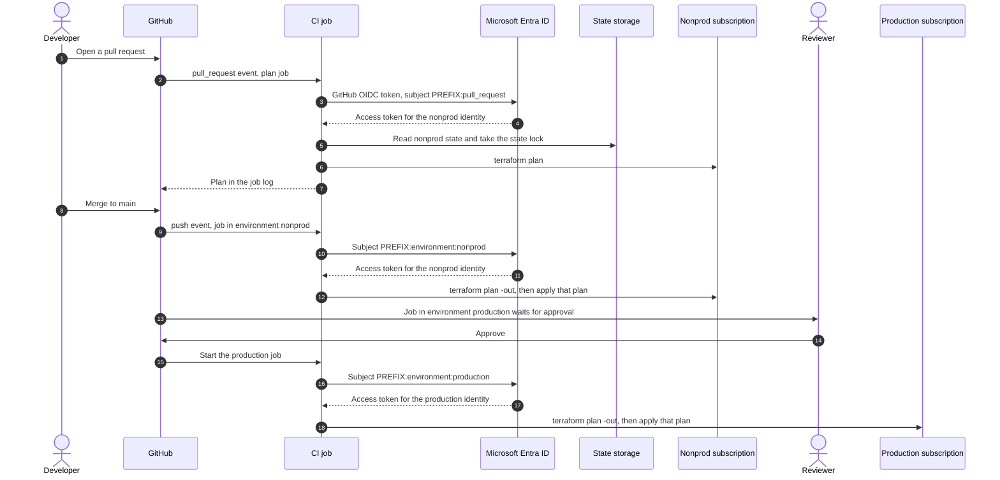
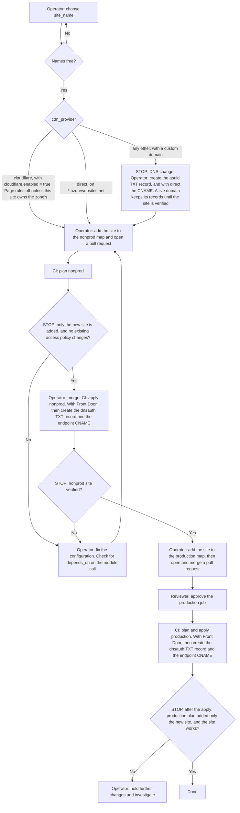

# Deployment guide

## Purpose

Run this module the way a consumer should in production:

- state is held remotely;
- CI signs in to Azure with OIDC, so it stores no secret;
- provider versions are pinned and locked;
- every change is planned on a pull request, applied to nonprod from `main`, and applied to production only after
  a reviewer approves.

The guide also covers what the module needs from its caller: the deployer-ID inputs, no `depends_on` on the
module call, resource locks, staging slots, shared plans, and adding and removing sites.

Code references are `file:line` at commit
[`54c19c6`](https://github.com/agenticcodingops/azure-wordpress/tree/54c19c66f834243f2ba8c142ab0a457ac13127c8),
which is release v4.1.1 plus documentation commits. Every name, ID and host name below is a placeholder.

## When to use

- You are moving from [getting started](getting-started.md) to a real deployment.
- You are adding or removing a site.
- You are reviewing an existing pipeline against the module's requirements.

## Prerequisites

- **Azure:** Owner, or Contributor plus User Access Administrator, on the subscriptions you deploy to and on the
  management subscription. You need this once, to create the role assignments in steps 2 and 9.
- **Three subscriptions:** one for nonprod, one for production, and a management subscription for the state account
  and the CI identities (steps 1 and 2). No CI identity holds a role on the management subscription itself.
  - **Why one per environment.** The module creates its own resource groups
    (`modules/wordpress-site/main.tf:185-188`), so each CI identity needs Contributor on a whole subscription.
    If nonprod and production shared one, pull-request code running as the nonprod identity could change
    production.
  - **Why a management subscription.** A role on a subscription applies to every resource group in it
    ([Microsoft Learn](https://learn.microsoft.com/en-us/azure/role-based-access-control/scope-overview)), so a
    separate resource group inside a deployment subscription keeps neither the state account nor the identities
    out of reach.
- **GitHub:** admin rights on the repository, to create environments and their protection rules. The steps use
  GitHub Actions. Other CI systems work the same way, with their own OIDC issuer and subject.
- **A GitHub plan that offers environment protection rules for your repository.** On GitHub Free, Pro and Team,
  required reviewers work only in public repositories. Deployment branch rules work in public repositories, and in
  private ones on Pro and Team
  ([GitHub docs](https://docs.github.com/en/actions/reference/workflows-and-actions/deployments-and-environments)).
  Without them, the production job does not wait for anyone. See step 2 for what that means.
- **Resource providers.** The module's resources live in these namespaces: `Microsoft.Web`,
  `Microsoft.DBforMySQL`, `Microsoft.KeyVault`, `Microsoft.Storage`, `Microsoft.Network`,
  `Microsoft.OperationalInsights` and `Microsoft.Insights`, plus `Microsoft.Cdn` for Front Door. With
  `resource_provider_registrations = "legacy"` the azurerm provider registers its 4.x set automatically. With
  `none` (the 5.x default), register them by hand once in each deploy subscription, nonprod and production, and not
  in the management subscription. **STOP:** yes, because this is an Azure change.

  ```bash
  for sub in <nonprod-subscription-id> <production-subscription-id>; do
    for ns in Microsoft.Web Microsoft.DBforMySQL Microsoft.KeyVault Microsoft.Storage Microsoft.Network \
              Microsoft.OperationalInsights Microsoft.Insights; do
      az provider register --subscription "$sub" --namespace "$ns" --wait
    done
  done
  ```

  Add `Microsoft.Cdn` to the list for Front Door.
- **Cloudflare, only with `cdn_provider = "cloudflare"` and `cloudflare.enabled = true`:** an existing zone, and
  Cloudflare API tokens for CI (step 5). The module looks the zone up on every plan
  (`modules/cloudflare/main.tf:16-18`), so plans need a token too, and not only applies.

## How the pipeline runs



`PREFIX` in the diagram is the start of the subject that GitHub puts in the token. Its form depends on the
repository (step 2).

Only a job in the `production` environment can get a production token, because the production identity trusts that
one subject. GitHub holds that job until a required reviewer approves it, but only when the environment has
administrator bypass turned off, and **Prevent self-review** on where a second reviewer exists (step 2). By default
a repository administrator can start the job with no approval, and the person whose merge started the run can
approve it. Administrators can also change the environment's rules, so repository admin is production access. The
pause also needs a repository and plan where required reviewers are available (see Prerequisites).

## Steps

### Step 1: Create the state store

**Who:** Azure administrator. **STOP:** yes. Every command creates or changes an Azure resource.

Terraform state for this module holds secrets in plain text: the generated database password
(`modules/wordpress-site/main.tf:209-213`), the storage account key and the Application Insights connection string
(`modules/wordpress-site/main.tf:377-381`). Terraform's own documentation warns that state can contain sensitive
data. Protect the state account like the secrets it holds.

```bash
mgmt=<management-subscription-id>

az group create --subscription "$mgmt" --name rg-tfstate-example --location eastus

az storage account create --subscription "$mgmt" --name sttfstateexample --resource-group rg-tfstate-example \
  --location eastus --sku Standard_LRS --kind StorageV2 --min-tls-version TLS1_2 \
  --allow-blob-public-access false --allow-shared-key-access false

az storage account blob-service-properties update --subscription "$mgmt" --account-name sttfstateexample \
  --resource-group rg-tfstate-example --enable-versioning true \
  --enable-delete-retention true --delete-retention-days 30 \
  --enable-container-delete-retention true --container-delete-retention-days 30

az storage container-rm create --subscription "$mgmt" --storage-account sttfstateexample \
  --name tfstate-nonprod --resource-group rg-tfstate-example

az storage container-rm create --subscription "$mgmt" --storage-account sttfstateexample \
  --name tfstate-production --resource-group rg-tfstate-example

az lock create --subscription "$mgmt" --name tfstate-protect --lock-type CanNotDelete \
  --resource-group rg-tfstate-example
```

- **Shared keys off.** Turning off shared-key access means only Microsoft Entra identities can read the state.
  The backend then needs `use_azuread_auth = true`, in `backend.hcl` or as `ARM_USE_AZUREAD=true`. The
  `backend.hcl` in [getting started](getting-started.md#the-configuration) sets it.
- **Versioning and blob soft delete** let you recover an earlier state file after a bad write or a deleted blob.
  They do not survive deleting the container or the account.
- **Container soft delete** restores a deleted container, with its blob versions, for 30 days. Each CI identity's
  data role includes the right to delete its own container through the data plane, and pull-request code runs as
  the nonprod identity (step 2).
- **The `CanNotDelete` lock** stops the account and its resource group from being deleted through Azure Resource
  Manager. Without it, a deleted account can be recovered only on a best-effort basis within 14 days
  ([Microsoft Learn](https://learn.microsoft.com/en-us/azure/storage/common/storage-account-recover)), and both
  environments' state goes with it.
  - Locks apply only to control-plane operations, so blob reads, writes and state locking are unaffected. That is
    also why the lock does not stop a data-plane container delete.
  - The lock blocks deleting role assignments and diagnostic settings in its scope. Remove it before you change or
    remove a CI identity's state role (step 2), then create it again. Both are STOPs.
- **Locking.** The `azurerm` backend locks state with Azure Blob Storage's own mechanisms, so two jobs cannot
  write the same state at once.
- **One container per environment.** Pull-request plans run the pull request's code as the nonprod identity
  (step 2). If both environments shared a container, that code could download production state, with its secrets.
  Step 2 gives each identity a data role on its own container only.
- **Keep the state account out of reach of the CI identities.** Put it in a subscription where neither identity
  holds Contributor: the management subscription from the Prerequisites. A separate resource group inside a
  deployment subscription is not enough, because the subscription-wide role applies to it too. Contributor can
  turn shared-key access back on and list the account keys, which would bypass the container-scoped roles.

### Step 2: Create the CI identities

**Who:** Azure administrator. **STOP:** yes. Check each subject string before you save it: it decides who can
deploy.

Create one identity per environment. A user-assigned managed identity is shown here; an app registration works
the same way.

```bash
mgmt=<management-subscription-id>

# Stop if this repository customises its subject. The credentials below use the default format, a custom
# template replaces that format, and none of them would then match a real token.
[ "$(gh api repos/ORG/REPO/actions/oidc/customization/sub --jq .use_default)" = "true" ] \
  || { echo "custom subject template: read a real token's subject first"; exit 1; }

# The start of the subject that GitHub puts in this repository's tokens (see "Subjects" below).
prefix=$(gh api repos/ORG/REPO/actions/oidc/customization/sub --jq '.sub_claim_prefix | strings | select(length > 0)')
echo "$prefix"   # repo:ORG/REPO, or repo:ORG@<owner-id>/REPO@<repo-id> for an immutable subject
[ -n "$prefix" ] || { echo "no sub_claim_prefix: read a real token's subject first"; exit 1; }

az group create --subscription "$mgmt" --name rg-identities-example --location eastus

az identity create --subscription "$mgmt" --name id-wordpress-nonprod \
  --resource-group rg-identities-example --location eastus

az identity federated-credential create --subscription "$mgmt" --name github-pull-request \
  --identity-name id-wordpress-nonprod --resource-group rg-identities-example \
  --issuer https://token.actions.githubusercontent.com \
  --subject "$prefix:pull_request" --audiences api://AzureADTokenExchange

az identity federated-credential create --subscription "$mgmt" --name github-env-nonprod \
  --identity-name id-wordpress-nonprod --resource-group rg-identities-example \
  --issuer https://token.actions.githubusercontent.com \
  --subject "$prefix:environment:nonprod" --audiences api://AzureADTokenExchange
```

**Keep the identities in the management subscription.** Contributor grants everything except role and
authorization changes
([Microsoft Learn](https://learn.microsoft.com/en-us/azure/role-based-access-control/built-in-roles/privileged#contributor)).
That includes `Microsoft.ManagedIdentity/userAssignedIdentities/federatedIdentityCredentials/write`. If the nonprod
identity held Contributor over the resource group that holds `id-wordpress-production`, pull-request code could add
its own federated credential to the production identity, sign in as it, and skip the production approval.

Create `id-wordpress-production` the same way, with **one** federated credential, for
`"$prefix:environment:production"`.

Then assign each identity its roles. For the nonprod identity:

```bash
principal_id=$(az identity show --subscription "$mgmt" --name id-wordpress-nonprod \
  --resource-group rg-identities-example --query principalId -o tsv)

az role assignment create --assignee-object-id "$principal_id" --assignee-principal-type ServicePrincipal \
  --role Contributor --scope /subscriptions/<nonprod-subscription-id>

az role assignment create --assignee-object-id "$principal_id" --assignee-principal-type ServicePrincipal \
  --role "Storage Blob Data Owner" \
  --scope /subscriptions/$mgmt/resourceGroups/rg-tfstate-example/providers/Microsoft.Storage/storageAccounts/sttfstateexample/blobServices/default/containers/tfstate-nonprod
```

Repeat for the production identity, with the production subscription and the `tfstate-production` container.

| Identity | Federated subjects | Azure roles |
|---|---|---|
| nonprod | `PREFIX:pull_request`, `PREFIX:environment:nonprod` | Contributor on the dedicated nonprod subscription; a data-plane role on the `tfstate-nonprod` container only; lock permission if nonprod uses locks (step 9) |
| production | `PREFIX:environment:production` | Contributor on the separate production subscription; a data-plane role on the `tfstate-production` container only; lock permission if production uses locks (step 9) |

- **Subjects.** Entra matches a federated credential's subject exactly, and GitHub issues one of two default
  formats. `PREFIX` above and below stands for the value of `$prefix`.
  - Repositories created, renamed or transferred after 15 July 2026, and older ones opted in at the repository or
    organization level, use the immutable prefix `repo:ORG@OWNER_ID/REPO@REPO_ID`. Other repositories use
    `repo:ORG/REPO`.
  - A job that references an environment gets `PREFIX:environment:NAME`, not the branch. A pull-request job with no
    environment gets `PREFIX:pull_request`.
  - These are default subjects. If the repository or organization uses a custom subject template (`use_default` is
    `false` in the same API response), none of them apply.
  - GitHub's live API returns `sub_claim_prefix`, but its REST reference does not list it yet. If the call returns
    nothing, read the subject of a real token, for example with GitHub's `github/actions-oidc-debugger` action,
    instead of guessing.
  - Renaming or transferring the repository, or opting it in to immutable subjects, changes the prefix and breaks
    every credential. Create the new credential next to the old one, run the workflow, then delete the old one
    ([GitHub: immutable subject claims](https://docs.github.com/en/actions/reference/security/oidc#immutable-subject-claims);
    [Microsoft Learn: migrate to immutable subjects](https://learn.microsoft.com/en-us/entra/workload-id/workload-identities-github-immutable-subjects)).
    That keeps the production identity at exactly one credential, the one Verify item 4 checks for.
  - Name-based subjects can be recycled. Owners of older repositories can opt in to immutable subjects in the
    repository or organization OIDC settings.
  - A sign-in that fails with `AADSTS700213` prints the subject the token carried. Fix the credential only if that
    string is your repository's prefix followed by exactly `pull_request` or `environment:nonprod` (nonprod
    identity), or `environment:production` (production identity). Never add a `ref:` (branch) subject, or a subject
    from any other job, to the production identity: it would skip the approval.
- **Pull-request plans run the pull request's code** with the nonprod identity. Anyone who can open a pull request
  in the repository can act as that identity during the plan. Keep it scoped to nonprod.
- **State role.** The command above follows Terraform 1.9's backend documentation, which asks for Storage Blob Data
  Owner when you use Entra ID authentication. The current documentation recommends Storage Blob Data Contributor on
  the container. If you run a newer Terraform, use the role its documentation names.
- **Contributor is enough to deploy** because the module creates no role assignments. It is not enough for locks
  (step 9).
- **Key Vault.** The deploying identity writes secrets through the vault's data plane, so the vault's firewall must
  let the runner in. See [the two network inputs](getting-started.md#the-two-network-inputs).

In GitHub, create the environments `nonprod` and `production`. **STOP:** yes, because this changes GitHub
settings. On `production`:

- add **required reviewers**: at least two people, or a team, so that someone other than the person who merged can
  approve;
- select **Prevent self-review** when a reviewer other than the person who merges can approve. The production run
  starts from the push to `main`, so this stops whoever merges from approving their own deployment. With a single
  reviewer who also merges, leave it cleared, because it would block every production deployment. That team has no
  two-person control, so do not rely on the gate;
- clear **Allow administrators to bypass configured protection rules**. GitHub selects it by default, and while it
  is selected any repository administrator can start the waiting production job with no approval
  ([GitHub docs](https://docs.github.com/en/actions/reference/workflows-and-actions/deployments-and-environments#allow-administrators-to-bypass-configured-protection-rules));
- under **deployment branches and tags**, allow only `main`, so that a job from another branch cannot use the
  environment.

Repository administrators can still edit or delete these rules, so keep that group small and treat repository admin
as production access.

Protect `main` with a ruleset that has no bypass actors. It should require a pull request with at least one
approval and the `plan-nonprod` check, and block force pushes and deletion. Without it, a writer can push straight
to `main`: nonprod is applied with no pull-request plan, and the production job asks a reviewer to approve a change
that nobody has read. A one-person team cannot meet an approval count either, so say so rather than rely on the
gate.

If nonprod holds a Cloudflare write token (step 5), set its deployment branches and tags to `main` only as well.
Without that rule, a pull request can add `environment: nonprod` to a job in its own copy of the workflow and read
the nonprod secrets. The plan job still references no environment, so its OIDC subject does not change.

**If your plan does not offer these rules for this repository** (for example, a private repository on GitHub
Free), the environment pauses nothing. Any workflow that names `production`, from any branch, then gets a token
with the production subject. Treat write access to the repository as production access, or move the repository to
a plan that offers the rules.

Store the client IDs, tenant ID and subscription IDs as **repository** variables. They are not secrets.

- **Not as environment variables.** GitHub makes an environment's variables available only to jobs that reference
  that environment
  ([GitHub docs](https://docs.github.com/en/actions/reference/workflows-and-actions/deployments-and-environments)).
- **Why that breaks the pull-request plan.** The plan job references no environment, so it could not read them.
  Adding an environment to that job would change its token subject away from `PREFIX:pull_request`.

### Step 3: Pin providers exactly and commit the lock file

**Who:** operator. **STOP:** no.

The module sets ranges, not exact versions: azurerm `~> 5.6`, azapi `>= 1.13.0, < 3.0`, random `>= 3.5.0, < 4.0`,
cloudflare `~> 5.0` and time `>= 0.9.0, < 1.0` (`modules/wordpress-site/main.tf:17-46`), and null
`>= 3.2.0, < 4.0` (`modules/database/versions.tf:14-17`). Your root configuration fixes the exact versions.

```hcl
terraform {
  required_version = "1.9.8"

  required_providers {
    azurerm = {
      source  = "hashicorp/azurerm"
      version = "5.8.0" # an exact version inside the module's ~> 5.6
    }
  }
}

module "wordpress_sites" {
  # A release tag. For an immutable reference, use the tag's commit SHA instead.
  source = "github.com/agenticcodingops/azure-wordpress//modules/wordpress-site?ref=v4.1.1"
  # ...
}
```

Then generate the lock file with hashes for every platform that runs Terraform, and commit it:

```bash
terraform init -backend=false
terraform providers lock -platform=linux_amd64 -platform=darwin_arm64 -platform=darwin_amd64 -platform=windows_amd64
git add .terraform.lock.hcl
```

- **The lock file fixes all six providers,** including the ones only the module declares. On 2026-10-03 a fresh
  `init` against v4.1.1 selected azurerm 5.8.0, azapi 2.13.0, cloudflare 5.26.0, null 3.3.2, random 3.9.1 and
  time 0.14.2.
- **CI runs `terraform init` without `-upgrade`,** so it installs exactly what the lock file records.
- **Upgrade in a pull request:** change the pin, run `terraform init -upgrade -backend=false` and then the
  `providers lock` command above, and commit the lock file. Like the `init` above, this needs no backend and no
  access to state. `-upgrade` re-selects every provider, and not only the one you changed: any provider you have not
  pinned exactly, such as the five that only the module constrains, moves to its newest allowed version. Check the
  lock file's diff, then review the pull request's plan.
- This module's own repository does not commit a lock file (`.gitignore:16`), because it is a library. Your root
  configuration is not.

### Step 4: Lay out one root configuration per environment

**Who:** operator. **STOP:** no.

```text
infra/
  nonprod/
    main.tf               # module calls with environment = "nonprod"
    backend.hcl           # container_name = "tfstate-nonprod"
    .terraform.lock.hcl
  production/
    main.tf               # module calls with environment = "production"
    backend.hcl           # container_name = "tfstate-production"
    .terraform.lock.hcl
```

- **One `for_each` over a map of sites** in each environment, as in
  [`examples/multi-site/main.tf`](../examples/multi-site/main.tf) (`examples/multi-site/main.tf:64-74`).
- **Coming from [getting started](getting-started.md)?** Its root calls the module once, as `module "wordpress"`,
  without `for_each`. Renaming that call, or only adding `for_each` to it, gives every resource a new address.
  Terraform then plans to destroy the running site and create it again under the same names. The creates fail while
  the old names are still in use, and the destroys delete the database, media and vault anyway. To keep the site,
  add this block to `infra/nonprod/main.tf`, using the site's key in your map (with `site_name = each.key`, as in
  `examples/multi-site`, the key is the `site_name`):

  ```hcl
  moved {
    from = module.wordpress
    to   = module.wordpress_sites["examplewp01"]
  }
  ```

  Write it on separate lines, because Terraform rejects a one-line `moved` block that has two arguments. Point
  getting started's two outputs at `module.wordpress_sites["examplewp01"]` as well, or the plan fails with
  "Reference to undeclared module".

  Make this change in its own pull request. Its plan must list every resource as `has moved to` and read
  `Plan: 0 to add, 0 to change, 0 to destroy.` Do not merge a plan that destroys anything, because the nonprod job
  applies on merge without a pause. **STOP:** yes, a merge. If you do not need the evaluation site, remove it first with getting started's
  Rollback, then convert.
- **Promote a module upgrade** by changing the `?ref=` in `nonprod/` first, and in `production/` in a later pull
  request.
- **Provider configuration.** With the OIDC variables from step 5, `provider "azurerm" { features {} }` needs no
  other arguments: azurerm reads `ARM_SUBSCRIPTION_ID`, `ARM_CLIENT_ID`, `ARM_TENANT_ID` and `ARM_USE_OIDC`. The
  `azapi` provider reads the same variables, which matters when `cdn_provider = "azure_front_door"`.
- **Cloudflare provider configuration.** With `cdn_provider = "cloudflare"`, declare `provider "cloudflare" {}` with
  no arguments. It reads `CLOUDFLARE_API_TOKEN`. Do not pass the token as a Terraform variable, as
  `examples/basic-site` does (`api_token = var.cloudflare_api_token`): a saved plan file stores input variables in
  cleartext, so the token would travel with `tfplan`.

### Step 5: Write the pipeline

**Who:** operator. **STOP:** yes. Have a second person review the workflow before it can reach production.

A GitHub Actions sketch of the diagram above. Pin each action to a full commit SHA.

```yaml
name: infrastructure

on:
  pull_request:
    branches: [main]
  push:
    branches: [main]

permissions:
  contents: read
  id-token: write # lets each job request a GitHub OIDC token

env:
  ARM_USE_OIDC: "true"
  ARM_USE_AZUREAD: "true"
  ARM_TENANT_ID: ${{ vars.AZURE_TENANT_ID }}

jobs:
  plan-nonprod:
    if: github.event_name == 'pull_request'
    runs-on: ubuntu-latest
    env:
      ARM_CLIENT_ID: ${{ vars.NONPROD_CLIENT_ID }}
      ARM_SUBSCRIPTION_ID: ${{ vars.NONPROD_SUBSCRIPTION_ID }}
      # Only with Cloudflare. A read-only token, as a repository secret:
      # CLOUDFLARE_API_TOKEN: ${{ secrets.CLOUDFLARE_API_TOKEN_READ }}
    defaults:
      run:
        working-directory: infra/nonprod
    steps:
      - uses: actions/checkout@<commit-sha>
      - uses: hashicorp/setup-terraform@<commit-sha>
        with:
          terraform_version: 1.9.8
      - run: terraform init -input=false -backend-config=backend.hcl
      - run: terraform plan -input=false -lock-timeout=10m

  apply-nonprod:
    if: github.event_name == 'push'
    runs-on: ubuntu-latest
    environment: nonprod
    concurrency: nonprod
    env:
      ARM_CLIENT_ID: ${{ vars.NONPROD_CLIENT_ID }}
      ARM_SUBSCRIPTION_ID: ${{ vars.NONPROD_SUBSCRIPTION_ID }}
      # Only with Cloudflare. nonprod's own write token, as an environment secret:
      # CLOUDFLARE_API_TOKEN: ${{ secrets.CLOUDFLARE_API_TOKEN }}
    defaults:
      run:
        working-directory: infra/nonprod
    steps:
      - uses: actions/checkout@<commit-sha>
      - uses: hashicorp/setup-terraform@<commit-sha>
        with:
          terraform_version: 1.9.8
      - run: terraform init -input=false -backend-config=backend.hcl
      - run: terraform plan -input=false -lock-timeout=10m -out=tfplan
      - run: terraform apply -input=false -lock-timeout=10m tfplan

  apply-production:
    needs: apply-nonprod
    runs-on: ubuntu-latest
    environment: production # waits for a required reviewer
    concurrency: production
    env:
      ARM_CLIENT_ID: ${{ vars.PRODUCTION_CLIENT_ID }}
      ARM_SUBSCRIPTION_ID: ${{ vars.PRODUCTION_SUBSCRIPTION_ID }}
      # Only with Cloudflare. production's own write token, as an environment secret:
      # CLOUDFLARE_API_TOKEN: ${{ secrets.CLOUDFLARE_API_TOKEN }}
    defaults:
      run:
        working-directory: infra/production
    steps:
      - uses: actions/checkout@<commit-sha>
      - uses: hashicorp/setup-terraform@<commit-sha>
        with:
          terraform_version: 1.9.8
      - run: terraform init -input=false -backend-config=backend.hcl
      - run: terraform plan -input=false -lock-timeout=10m -out=tfplan
      - run: terraform apply -input=false -lock-timeout=10m tfplan
```

- **What reviewers see.** Each pull request shows the nonprod plan, and the nonprod apply runs before the
  production job. The production job plans and applies after its approval, so the reviewer approves before the
  production plan exists. The nonprod plan shows what the module creates for a change, but not production's
  values. Production resolves different defaults for the MySQL SKU, backups, Key Vault purge protection and
  retention, and log retention (`modules/wordpress-site/main.tf:97-116`, `:168`), and for the app's `WP_DEBUG`
  setting, `false` rather than `true` (`modules/app-service/main.tf:112`). With `cdn_provider = "azure_front_door"`,
  production's WAF policy runs in `Prevention` mode rather than `Detection` (`modules/wordpress-site/main.tf:143`),
  so it acts on requests that the nonprod WAF only logs.
- **If reviewers must read the production plan first,** split `apply-production` into a plan job and an apply job
  that `needs` it. Both set `environment: production`, because the production identity trusts only that subject,
  so each waits for a reviewer. A saved plan file can contain the same secrets as the state. Anyone who is
  signed in to GitHub and can read the repository can download a workflow artifact, so do not pass the plan
  file as an artifact in a public repository. Without an artifact, the apply job can re-plan and fail unless the
  resource addresses and actions match the plan that was read. Until you split the job, a production plan can be
  read only after it has applied.
- **`concurrency` and `-lock-timeout`.** `concurrency` runs one apply job per environment at a time, so two applies
  never compete for the state lock. Pull-request plans are outside these groups and also take the nonprod state
  lock. A plan that is waiting for the lock, or that starts in the seconds between the nonprod job's plan and apply
  steps, can hold it when the apply step starts. Without `-lock-timeout`, Terraform tries the lock once and fails,
  and the production job is then skipped. So every plan and apply step sets `-lock-timeout`. Do not put the plan
  job in the `nonprod` group: by default a newly queued job cancels the pending one, so a pull-request plan could
  cancel a waiting apply. A newer pending run replaces an older pending one; the newer run applies `main` as it is
  then.
- **Cloudflare tokens,** only with `cdn_provider = "cloudflare"` and `cloudflare.enabled = true`. **STOP:** yes,
  because they are Cloudflare changes.
  - **Apply tokens.** Create one per environment, each scoped to that environment's zone only. Give it Zone Read
    and DNS Edit, plus Page Rules Edit while `enable_page_rules` is on (the default). Add the matching Edit
    permission for each other feature you turn on: Cache Rules for `enable_cache_rules` (which Cloudflare's Cache Rules API page also pairs with
    Account Rulesets Edit and Account Filter Lists Edit, see `modules/cloudflare/README.md`), Zone WAF for
    `enable_waf`, Zone Settings for `enable_zone_setting_overrides`. Store each as the environment secret
    `CLOUDFLARE_API_TOKEN` on `nonprod` and on `production`, and set it only in the `env` of `apply-nonprod` and
    `apply-production`.
  - **Pull-request plan token.** Read-only: Zone Read, DNS Read and Page Rules Read cover the default features
    (drop Page Rules Read if `enable_page_rules` is false). Add Cache Rules Read, Zone WAF Read or Zone Settings Read for each of those features you turn on, because Zone Read does not
    cover reading rulesets or zone settings, and the plan's refresh fails without them. Store it as a repository
    secret under a different name, for example `CLOUDFLARE_API_TOKEN_READ`, and map it to `CLOUDFLARE_API_TOKEN` in
    `plan-nonprod` only. Anyone with write access can read it, and so can the pull request's own code.
  - **Never store a write token as a repository or organization secret.** GitHub gives every user with write
    access read access to all repository secrets, and the pull-request plan runs the pull request's code.
  - **One zone for both environments.** A token for that zone can change production records, and the nonprod apply
    runs without the production approval. Use a separate zone per environment, or treat the nonprod token as
    production access.
  - **Plan limits.** Environment secrets in private repositories need GitHub Pro, Team or Enterprise, and deployment
    branch rules in private repositories need Pro, Team or Enterprise. On GitHub Free with a private repository, no
    setting keeps a write token from anyone with write access, so treat write access to the repository as
    DNS-write access to the zone.

### Step 6: Decide whether to set the deployer-ID inputs

**Who:** operator. **STOP:** yes, when you change the value on an existing site.

The module gives the identity that runs Terraform an access policy on each site's Key Vault, so that it can write
the secrets (`modules/key-vault/main.tf:87-101`). By default the module reads that identity itself, with
`data "azurerm_client_config"` (`modules/wordpress-site/main.tf:66`, `:73-74`).

That read returns **whoever runs the plan**. If plan and apply run as different identities, for example a
separate identity that plans pull requests, the plan shows the Terraform access policy being replaced. The
planning identity also needs `Get` and `List` on each vault's secrets, granted outside the module, or the refresh
fails: the module gives secret access only to the deployer and the app identities
(`modules/key-vault/main.tf:70-101`, `modules/wordpress-site/main.tf:530-568`).

Set `deployer_object_id` and `deployer_tenant_id` when either of these is true
(`modules/wordpress-site/variables.tf:46-66`):

- plan and apply run as different identities;
- you must put your own `depends_on` on the module call. Avoid that anyway: see step 7.

In the pipeline above, each environment plans and applies as one identity, so you do not need them. If you set
them:

- **Set both, or neither.** A precondition fails the plan otherwise (`modules/wordpress-site/main.tf:193-196`).
- **Use the apply identity's object ID,** in lower case. Validation rejects upper case
  (`modules/wordpress-site/variables.tf:51-54`, `:62-65`).

  ```bash
  az identity show --subscription <management-subscription-id> --name id-wordpress-production \
    --resource-group rg-identities-example --query principalId -o tsv
  # or, for an app registration:
  az ad sp show --id <client-id> --query id -o tsv
  ```

- **The policy's `object_id` forces replacement.** A value that differs from the identity that created the existing
  policy replaces the policy. Do that only as a planned identity change.

### Step 7: Keep `depends_on` off the module call

**Who:** operator. **STOP:** no.

Never write `depends_on` on a `module "..."` block that calls `wordpress-site`.

Terraform defers every data source inside a module that has `depends_on` until apply, whenever any of the
`depends_on` targets has a pending change. Two things then break:

- **The Key Vault access policy.** The deployer read becomes unknown, and the plan replaces the Terraform access
  policy on every site. That replacement fails at apply, and a retry plans it again
  (`modules/wordpress-site/main.tf:56-66`; see "Upgrading to v4.0.2" in
  [the upgrade guide](upgrading/v4.0-to-v4.1.md#upgrading-to-v402)).
- **Cloudflare rulesets.** With `cdn_provider = "cloudflare"`, the zone lookup becomes unknown, and `zone_id`
  forces replacement on `cloudflare_ruleset` (`modules/wordpress-site/main.tf:907-912`).

Setting the deployer-ID inputs fixes only the first. If the module needs a value from another resource, pass it
in an input. The reference orders the work, with no `depends_on`.

### Step 8: Choose the App Service SKU

**Who:** operator. **STOP:** no.

The SKU decides whether the site gets a staging slot.

| Plan tier | Staging slot | Notes |
|---|---|---|
| Basic (`B1`-`B3`) | No | On a dedicated plan the module still creates an autoscale setting (`modules/app-service/main.tf:449-450`). Microsoft documents autoscale for Standard and up. Whether Azure accepts it on Basic is **UNKNOWN**. Use Basic through a shared plan (step 11). |
| Standard (`S1`-`S3`) | Yes | The cheapest tier with slots and autoscale. |
| Premium v2 and v3 (`P1v2`, `P1v3`, …) | Yes | `P1v3` is the default for a dedicated plan (`modules/wordpress-site/variables.tf:281`). |

The rule is `can(regex("^(S|P)[0-9]", sku))` (`modules/app-service/main.tf:24`), applied to the effective SKU
(`modules/wordpress-site/monitoring.tf:436`). The effective SKU is `shared_plan_sku` when
`app_service.use_shared_plan = true` and `shared_plan_sku` is set. Otherwise it is `app_service.sku_name`, which
defaults to `P1v3` (`modules/wordpress-site/main.tf:121`).

When a slot exists:

- it is named `staging` and has its own system-assigned identity (`modules/app-service/main.tf:331-353`);
- that identity gets `Get` and `List` on the site's Key Vault secrets (`modules/wordpress-site/main.tf:548-568`);
- `WP_HOME` and `WP_SITEURL` point at `https://app-<project>-<site>-<np|prod>-staging.azurewebsites.net`, and
  `WP_DEBUG` is `true` (`modules/app-service/main.tf:7`, `:436-440`);
- `always_on` is off on the slot unless you set `app_service.staging_always_on` (`modules/wordpress-site/variables.tf:289`).

Slots cost nothing extra. They exist on Standard, Premium and Isolated plans only
([Microsoft Learn](https://learn.microsoft.com/en-us/azure/app-service/deploy-staging-slots)). Moving a site from
S or P to B deletes its slot, and a resource lock blocks that (step 9).

### Step 9: Add resource locks

**Who:** Azure administrator, then operator. **STOP:** yes. A lock changes what every later apply can do.

```hcl
module "wordpress_sites" {
  for_each = local.sites
  # ...

  # Per site, so that one site can be unlocked without unlocking the others.
  lock = each.value.locked ? { kind = "CanNotDelete" } : null
}

module "shared" {
  # ...
  lock = { kind = "CanNotDelete" } # on the shared resource group
}
```

- **Only `CanNotDelete` is accepted** (`modules/wordpress-site/variables.tf:855-858`). ReadOnly would block the
  list operations every refresh needs.
- **The deploying identity needs `Microsoft.Authorization/locks/*`.** Owner and User Access Administrator have it,
  Contributor does not (`modules/wordpress-site/variables.tf:836`, `modules/wordpress-site/main.tf:977-978`).
  Grant it to each identity whose environment sets a lock, for example as a custom role with only that action,
  scoped to that environment's subscription.
- **A lock blocks every delete in its resource group,** including on diagnostic settings and alert rules. While it
  exists, these fail at apply:
  - removing a site (step 12 also covers the alert resources that Azure creates outside Terraform);
  - removing its staging slot;
  - any change that forces replacement, such as a new `key_vault_name_suffix` or a change to
    `geo_redundant_backup`.

  The full list is in "Resource locks" in [`modules/wordpress-site/README.md`](../modules/wordpress-site/README.md#resource-locks).
- **To make such a change:** unlock that site (`locked = false` in the pattern above) and apply, then make the
  change and apply, then lock it again and apply. A site that still uses `enable_resource_lock = true` needs
  `enable_resource_lock = false` instead.
- **Shared plan.** The shared lock covers every shared-plan site's app and slot
  (`modules/shared-infrastructure/main.tf:156-167`).

### Step 10: Onboard a site

**Who:** operator, CI and a reviewer, as marked in the flowchart. **STOP:** yes, at each diamond, at each merge
and at the production approval.



1. **Choose the name.** Four names are global across Azure, and the Key Vault and storage names use only
   `site_name` and the environment. See
   [names that must be unique](getting-started.md#names-that-must-be-unique).
2. **Prepare DNS, unless Cloudflare does it.** **STOP:** yes for every DNS change.
   - With `cdn_provider = "cloudflare"` and `cloudflare.enabled = true`, the module creates the site's records and
     the `asuid` verification record in your existing zone. It waits 120 seconds, then binds the custom domain to
     the app (`modules/wordpress-site/main.tf:878-969`). You create no DNS records by hand, but every plan and
     apply needs the Cloudflare token from step 5. Page rules are another matter.
     - The module also creates three page rules in the zone, on by default (`cloudflare.enable_page_rules`,
       `modules/wordpress-site/variables.tf:345`; `modules/cloudflare/page-rules.tf:17-86`). Their targets are built
       from the zone name: `*<cloudflare.domain>/wp-admin/*`, `*<cloudflare.domain>/wp-login.php*` and
       `*<cloudflare.domain>/wp-content/*`. They therefore match every host in the zone and are the same for every
       site in it ([wildcard matching](https://developers.cloudflare.com/rules/page-rules/reference/wildcard-matching/)).
     - Leave them on for exactly one site per zone, counting both the nonprod and the production root. Set
       `cloudflare.enable_page_rules = false` on every other site in that zone, including the same site's entry in
       the other environment when both hosts share the zone (for example `staging.example.com` and
       `example.com`). Otherwise the apply that creates the second set fails, and the custom-domain binding, which
       waits on the Cloudflare module, is not created.
     - A Free zone allows three page rules in total, disabled ones included
       ([Page Rules](https://developers.cloudflare.com/rules/page-rules/)). Before the first site's apply, check
       that the zone has room for three more. Removing the site that owns the rules (step 12) removes them for every
       site in the zone, so turn them on for another site first.
   - In every other case with a custom domain that does not end in `.azurewebsites.net`, the module creates no DNS
     records. That covers `azure_front_door`, `direct`, and `cloudflare` with `cloudflare.enabled` left at its
     default, `false` (`modules/wordpress-site/variables.tf:339`, `modules/wordpress-site/main.tf:153`). It still
     creates the App Service hostname binding, in the same apply (`modules/wordpress-site/main.tf:942-944`).
     - Create the TXT record `asuid.<subdomain>` = the app's domain verification ID in every case, for each
       environment's domain, before the first apply. It alone passes the binding check
       ([Microsoft Learn](https://learn.microsoft.com/en-us/azure/app-service/app-service-web-tutorial-custom-domain)).
       **STOP** if the domain already serves a live site: do not repoint its CNAME or A record until the new site
       is verified.
     - App Service also accepts a CNAME to the app, but only when the name resolves publicly to the app. That is
       never the case with Front Door, and not with a proxied Cloudflare record, which answers with Cloudflare's
       anycast addresses. With `direct`, also create CNAME `<subdomain>` -> the app's default host name (an A record
       for an apex domain). That record is the site's mapping.
   - The TXT value is the app's domain verification ID. `az webapp show` returns it for an app that exists:

     ```bash
     az webapp show --subscription <nonprod-subscription-id> --name app-example-examplewp01-np \
       --resource-group rg-example-examplewp01-np --query customDomainVerificationId -o tsv
     ```

     For the production domain, use `app-example-examplewp01-prod`, `rg-example-examplewp01-prod` and
     `--subscription <production-subscription-id>`.

     For a site on a shared plan (step 11), the app is not in the site's own resource group. It is in the group you
     pass as `shared_resource_group_name`: `rg-<project_name>-shared-np`, or `rg-<project_name>-shared-prod` in
     production (`modules/wordpress-site/main.tf:135`, `modules/shared-infrastructure/main.tf:35-44`). Pass that
     group as `--resource-group`. Do not take it from the module's `resource_group_name` output, which is always
     the site's group. For either layout, `az webapp show --ids <the module's app_service_id output> --query
     customDomainVerificationId -o tsv` also works.

     If you cannot create the record before the first apply, that apply fails at the binding. Create the record,
     then run the pipeline again. In production, the re-run waits for a reviewer again.
   - With Front Door, whether a first deploy applies cleanly has not been tested; see
     [Request flow: Azure Front Door](architecture.md#request-flow-azure-front-door). Do not point `<subdomain>` at
     the app. With `azure_front_door` the app answers HTTP 403 to everything except Front Door (only your own profile
     when `front_door.enabled` is true, the default; with it false, any Front Door profile), and the
     name must later hold the Front Door CNAME. Before the first apply, create only the `asuid` TXT record.
     After the apply has created the Front Door custom domain, create TXT `_dnsauth.<subdomain>` = the
     `custom_domain_validation_token` output, then CNAME `<subdomain>` = the `front_door_endpoint_hostname` output
     (`modules/wordpress-site/outputs.tf:146-149`, `:161-164`, `modules/front-door/README.md:79-89`). An apex domain
     cannot hold a CNAME: use an alias record (Azure DNS) or your provider's CNAME flattening. Do this for each
     environment's domain.
   - With `direct` and a custom domain ending in `.azurewebsites.net`, as in
     [getting started](getting-started.md), there is no binding and no DNS to prepare.
3. **Add one map entry** in `infra/nonprod/main.tf` and open a pull request.
4. **Read the plan.** It must add only the new site's resources. It must not update or replace
   `azurerm_key_vault_access_policy.terraform` on any existing site. If it does, look for a `depends_on` on the
   module call (step 7) or a change of planning identity (step 6).
5. **Merge,** let CI apply nonprod, and check the site. **STOP:** yes, a merge and an Azure change.
6. **Repeat in `infra/production/`** in a second pull request. Its plan job plans nonprod, which shows no
   changes. After you merge, the production job waits for a reviewer, then plans and applies.
   **STOP:** yes, a merge and a production deployment, which the reviewer must approve.
7. **Read the production job's plan** in its log. It must meet the same test as item 4. If it does not, hold
   further changes and investigate before the next apply. The pipeline in step 5 plans and applies in one job, so
   this plan is read after it has applied. To read it first, split the job as step 5 describes.

### Step 11: Host several sites on a shared plan

**Who:** operator. **STOP:** yes. Adding the shared plan creates Azure resources, and switching an existing site
to it would force a new web app and slot.

One App Service plan can host many sites. Each site keeps its own resource group, MySQL server, Key Vault,
storage account and network.

```hcl
module "shared" {
  source = "github.com/agenticcodingops/azure-wordpress//modules/shared-infrastructure?ref=v4.1.1"

  project_name    = "example"
  environment     = "nonprod"
  location        = "eastus"
  app_service_sku = local.plan_sku
}

module "wordpress_sites" {
  for_each = local.sites
  source   = "github.com/agenticcodingops/azure-wordpress//modules/wordpress-site?ref=v4.1.1"
  # ...

  app_service = {
    plan_id         = module.shared.app_service_plan_id
    use_shared_plan = true
  }
  shared_resource_group_name = module.shared.resource_group_name
  shared_plan_sku            = local.plan_sku
}
```

- **Set `use_shared_plan = true` explicitly.** It keeps the plan decision known at plan time
  (`modules/app-service/main.tf:13-17`).
- **Set `shared_plan_sku` from the same value as `app_service_sku`.** Slot detection reads it. If you leave it
  unset, detection falls back to `app_service.sku_name`, which defaults to `P1v3`, and plans a slot even on a Basic
  plan (`modules/wordpress-site/main.tf:121`).
- **For a new site, the web app and its slot are created in the shared resource group,** because Azure requires an
  app and its plan to share a resource group (`modules/wordpress-site/main.tf:132-135`). The shared lock (step 9)
  therefore covers them.
- **Do not switch an existing site to `use_shared_plan = true`. STOP.** Its web app would change resource group
  (`modules/wordpress-site/main.tf:135`), and a new resource group forces a new web app
  ([azurerm `azurerm_linux_web_app`](https://registry.terraform.io/providers/hashicorp/azurerm/latest/docs/resources/linux_web_app)).
  The staging slot belongs to the app, so it is replaced with it. What happens next is read from the code and has
  not been run:
  - **With a custom-domain binding,** the binding sets `create_before_destroy = true`
    (`modules/wordpress-site/main.tf:962-968`). Terraform is expected to try to create the new app first, and Azure
    rejects the duplicate name because the old app still holds it.
  - **Without a binding** (a custom domain ending in `.azurewebsites.net`, so the binding has `count = 0`,
    `modules/wordpress-site/main.tf:944`), nothing in the module sets `create_before_destroy` to true, and the app
    resource sets it to `false` (`modules/app-service/main.tf:320`). Read that case as destroy, then create: the
    app and its `/home` content are deleted.
  - **Either way,** read the plan for `must be replaced` on the web app and its slot, and do not apply it. Revert
    the change if the plan shows it.
  - To move a site onto a shared plan, migrate it. **STOP** at each of these: create a new site under a new
    `site_name` on the shared plan, copy the database and the app's `/home` content (plugins, themes, anything not
    offloaded), switch DNS, then remove the old site (step 12).
- **No autoscale setting by default.** `shared-infrastructure` creates one only with `enable_autoscale = true`
  (`modules/shared-infrastructure/variables.tf:50-53`). Keep it off on Basic.
- **PHP memory.** The module sets `PHP_MEMORY_LIMIT = 256M` on every site and its staging slot, on a dedicated
  plan as well as a shared one (`modules/app-service/main.tf:87-94`, `:287`, `:436`). The container's default and
  maximum is 512M
  ([Microsoft Learn](https://learn.microsoft.com/en-us/azure/app-service/reference-app-settings#wordpress)). To
  raise it, add `PHP_MEMORY_LIMIT = "512M"` to `app_service.extra_app_settings`, which reaches the slot too.
- **How many sites a plan can carry is not measured.** The [cost guide](cost.md#2-estimate-a-shared-plan) compares
  dedicated and shared plans and says what is unknown. Watch the plan's CPU and memory after each site you add.

### Step 12: Remove a site

**Who:** operator, then CI. **STOP:** yes. This deletes the site's database, blob storage, vault and the web app's
files.

1. **Back up from inside the network, and check each copy before you go on.** The backup only reads data. Opening
   the SCM or storage firewall to your address first is an Azure change, so that part is a STOP.
   - **Why your workstation cannot do this.** The MySQL server has no public endpoint, and its subnet admits port
     3306 only from the App Service subnet (`modules/database/main.tf:64-66`, `modules/networking/main.tf:137-171`).
     An export from your workstation cannot connect.
   - **Where to work.** Use the app's SSH console: the SCM site's SSH option, or `az webapp ssh`. If you set
     `app_service_scm_ip_restriction_default_action = "Deny"`, allow your address first.
   - **Database:** `mkdir -p /home/backups && wp db export /home/backups/wordpress.sql --path=/home/site/wwwroot --allow-root`.
     WP-CLI runs `mysqldump`. If the container lacks it, install it in the same session. Never write the dump under
     `/home/site/wwwroot`, which is the public web root.
   - **Site files:** `tar -czf /home/backups/wwwroot.tar.gz -C /home/site wwwroot`. The app's own storage holds
     `wp-config.php`, themes and plugins. It also holds the uploads unless you installed the storage plugin, which
     this module does not install. It is deleted with the web app.
   - **Download** both files through the SCM (Kudu) site.
   - **Blob containers:** copy every container in the account, not only uploads, for example
     `az storage blob download-batch --auth-mode key ...`. `--auth-mode login` needs Storage Blob Data Reader, which
     Owner and Contributor do not include. If `storage_network_rules_default_action` is `Deny`, first add your
     public IPv4 address (a plain address, not a /32) to `storage_network_rules_ip_rules`, and apply.
   - **Alternative for the database:** a point-in-time restore to a new server in a resource group and virtual
     network that Terraform does not manage. A restore keeps the source's virtual network unless you change it on
     the Networking tab, and a copy left in `snet-db-<site>` stops that subnet from being deleted.
   - **Check before you continue:** the dump lists the site's tables, and the archive extracts.

   Blob soft delete does not protect against deleting the storage account
   ([Microsoft Learn](https://learn.microsoft.com/en-us/azure/storage/blobs/soft-delete-blob-overview)).
2. **Remove the locks.** **STOP:** yes, because this changes Azure. Unlock that site (step 9), and the shared plan
   if the site uses it. Apply. Also plan the DNS removal in item 5. A lock blocks deletes only, so while the shared
   lock is off, the other shared-plan sites' apps and slots are unprotected.
3. **Remove the map entry** and open a pull request.
4. **Read the pull request's plan.** The plan job plans nonprod only (step 5). It must destroy only that site's
   nonprod resources. If it plans any change to another site, stop. A pull request that changes only
   `infra/production/` shows `No changes` here, which says nothing about production.
5. **Remove the DNS records you created by hand in step 10,** for each environment's domain, before that
   environment's apply: before you merge for nonprod, and before you approve the production job. **STOP:** DNS
   change. Skip this item only with `cdn_provider = "cloudflare"` and `cloudflare.enabled = true`, where the destroy
   deletes the module's records before the app.
   - Delete the CNAME first (the A record for an apex domain, plus any `www` record you added).
   - After the apply, delete the `asuid.<subdomain>` TXT record (`asuid` for an apex) and, with Front Door, the
     `_dnsauth.<subdomain>` TXT record.
   - Never delete the `asuid` record while the CNAME still exists.

   A CNAME left pointing at `app-<project>-<site>-<env>.azurewebsites.net` after the app is deleted is a dangling
   record. App Service holds a deleted app's name for your tenant only for a while. After that, anyone can create an
   app with the same name and, with no `asuid` record in place, bind your domain to it (subdomain takeover).
   Microsoft says to update DNS before the site is deleted
   ([App Service](https://learn.microsoft.com/en-us/azure/app-service/reference-dangling-subdomain-prevention),
   [subdomain takeover](https://learn.microsoft.com/en-us/azure/security/fundamentals/subdomain-takeover)).
   Front Door endpoint names carry a tenant-scoped hash, so a Front Door CNAME is far less exposed, but delete it
   too.
6. **Merge,** let CI apply nonprod, and check the other nonprod sites. **STOP:** yes, a merge.
7. **Production.** **STOP:** yes, a production deployment. The step 5 pipeline plans and applies production in one
   job after the approval, and a saved plan applies without a prompt, so nobody can read the production destroy plan
   before it runs.
   - Before removing a production site, split `apply-production` as step 5 describes: a plan job, and an apply job
     that `needs` it. Both set `environment: production`, so each waits for a reviewer.
   - Merge the production change first. `production` accepts only `main`, so its plan cannot exist before the
     merge.
   - Approve the plan job and read its plan in the log. Approve the apply job only if the plan destroys only that
     site's resources. Otherwise reject it and revert the pull request.
   - Without the split, the production plan can be read only after it has applied. Keep every other production
     site locked during the removal, so that a stray delete fails at apply.
8. **If an apply stops at the site's resource group, clear what Azure created outside Terraform.** **STOP:**
   yes, because this deletes Azure resources.
   - **What is there.** When the module created the site's Application Insights component, Azure added a
     `Failure Anomalies - appi-<project>-<site>-<np|prod>` smart-detector alert rule to the site's resource group
     `rg-<project>-<site>-<np|prod>`. It usually also added an `Application Insights Smart Detection` action group
     there (see [Failure Anomalies](../modules/wordpress-site/README.md#failure-anomalies-platform-created)).
   - **Why it matters.** Neither resource is in state, and Azure does not delete the rule when the component is
     deleted ([Microsoft Learn](https://learn.microsoft.com/en-us/azure/azure-monitor/alerts/proactive-failure-diagnostics)).
     With `features {}` (step 4), the provider's `prevent_deletion_if_contains_resources` is `true`, so it refuses
     to delete a resource group that still holds resources. The delete at the end of the removal apply then waits
     for 10 minutes and fails, after everything else in the group has been destroyed. Every later apply in that
     environment plans the group's deletion again and fails the same way, and in the step 5 workflow
     `apply-production` needs `apply-nonprod`, so a stuck nonprod removal also skips every production job.
   - **What to do.** Do not delete them before the apply: while the component exists, Azure may create the rule
     again. Once the apply has destroyed the component, check each ID that the error lists, and delete only the
     two platform-created resources:

     ```bash
     az resource list --subscription <sub> -g rg-<project>-<site>-<np|prod> \
       --query "[?starts_with(name, 'Failure Anomalies - ') || name=='Application Insights Smart Detection'].id" -o tsv
     az resource delete --ids "<each id printed above>"
     ```

     If anything else is listed, stop and find out what created it. Then run the failed job again. In production the
     re-run is a STOP.
   - **Do not set `prevent_deletion_if_contains_resources = false`** for the provider. It would delete everything
     else in any group that Terraform removes. `application_insights { disable_generated_rule = true }` is not a
     fix either: the provider then deletes the rule on destroy, but not the action group.
9. **Put the shared lock back** if you removed it. **STOP:** yes, because this changes Azure.

After removal:

- **Production Key Vault names stay reserved.** Production vaults have purge protection on, with 90-day soft-delete
  retention (`modules/wordpress-site/main.tf:113-116`). A soft-deleted vault's name cannot be reused until the
  retention period ends, and with purge protection on it cannot be purged early
  ([Microsoft Learn](https://learn.microsoft.com/en-us/azure/key-vault/general/soft-delete-overview)). To reuse
  the `site_name` sooner, set a new `key_vault_name_suffix` (`modules/wordpress-site/variables.tf:825-829`).
- **Nonprod vault names are free at once.** Purge protection is off there, and the azurerm provider purges a vault
  on destroy by default.
- **The site's resource group is gone.** `az group exists -n rg-<project>-<site>-<np|prod>` prints `false`, and the
  next plan reports no changes.
- **Late recovery is best-effort, and needs the resource group back.** Removal deletes the site's resource group.
  Microsoft documents three late recoveries:
  - a deleted web app, with its files, within 30 days on paid plans
    ([Microsoft Learn](https://learn.microsoft.com/en-us/azure/app-service/app-service-undelete));
  - a deleted storage account within 14 days, if no account has taken its name, which is not guaranteed
    ([Microsoft Learn](https://learn.microsoft.com/en-us/azure/storage/common/storage-account-recover));
  - a deleted MySQL server for up to five days through the REST API, only while its backup still exists
    ([Microsoft Learn](https://learn.microsoft.com/en-us/azure/mysql/flexible-server/how-to-restore-dropped-server)).

  The last two require you to recreate the resource group with its original name first.

## Verify

**Who:** operator, after every apply. **STOP:** no, except where an item says otherwise.

1. **The configuration converges.** Re-plan as the environment's CI identity, never as yourself, and apply nothing.
   - **Nonprod:** read the nonprod plan of a pull request that changes nothing under `infra/nonprod/`. The
     production pull request in step 10 is one. It must report no changes.
   - **Production.** **STOP:** yes, because dispatching a production job is a STOP. The step 5 pipeline has no
     plan-only job, and re-running `apply-production` applies whatever it plans. Add `workflow_dispatch:` to `on:`,
     and add a job with `environment: production` that runs only
     `terraform init -input=false -backend-config=backend.hcl` and
     `terraform plan -input=false -lock-timeout=10m -detailed-exitcode`.
     - Exit code 0 means no changes, and 2 means changes. Set `terraform_wrapper: false` on
       `hashicorp/setup-terraform`, because its wrapper treats exit code 2 as success, so the job would pass with
       changes present.
     - Give the job its own concurrency group, not `production`, so that it cannot replace a pending apply.
     - Dispatch it from `main`. It waits for the production reviewers, like the apply job.
     - A nonprod dispatch job must also reference `environment: nonprod`. Without an environment, the token subject
       is `PREFIX:ref:refs/heads/main`, which neither identity trusts.
   - **Not under your own identity.** Such a plan cannot pass. The guide gives you no role on the state container
     and no access policy on the vaults, so the refresh fails. If you grant those, `data.azurerm_client_config`
     returns you, and the plan replaces `azurerm_key_vault_access_policy.terraform` (step 6). Never apply that plan:
     it deletes the pipeline's own policy, and the next pipeline refresh fails with 403.
   - **With `cdn_provider = "azure_front_door"`, an empty plan is not expected.** The plan after an apply shows the
     web app restoring the module's restriction list: the health-probe rule, with no `X-Azure-FDID` check. Applying
     that removes the Front Door ID check. The following plan should then show
     `azapi_update_resource.app_service_front_door_restriction` patching the list back. This follows from the code
     and is untested (see [architecture](architecture.md#request-flow-azure-front-door)). Review those two
     resources rather than requiring no changes.
   - **With `cloudflare`,** a change in Cloudflare's published IP ranges also shows up as an update.
2. **No access policy churn.** In any plan, `azurerm_key_vault_access_policy.terraform` must not be updated or
   replaced, and its `object_id` must be known. A `will be read during apply` line for
   `module.key_vault.data.azurerm_client_config.current` is harmless
   (`modules/key-vault/main.tf:4-9`).
3. **Locks are in place** where you set them:

   ```bash
   az lock list --subscription <production-subscription-id> --resource-group rg-example-examplewp01-prod \
     --query "[].{name:name, level:level}" -o table
   ```

   For nonprod, use the `-np` group and `--subscription <nonprod-subscription-id>`. If the shared lock is set, also
   run the same command for `rg-<project>-shared-prod` or `rg-<project>-shared-np`.

4. **Only reviewed jobs reach production.** Check the environment's rules and the protection on `main`:

   ```bash
   gh api repos/ORG/REPO/environments/production \
     --jq '{can_admins_bypass, rules: [.protection_rules[] | {type, prevent_self_review}], deployment_branch_policy}'
   gh api repos/ORG/REPO/environments/production/deployment-branch-policies \
     --jq '.branch_policies[] | [.type, .name] | @tsv'
   gh api repos/ORG/REPO/rules/branches/main --jq '[.[].type] | unique'
   ```

   - `can_admins_bypass` is `false`.
   - There is a `required_reviewers` rule, with `prevent_self_review` true where step 2 called for it.
   - `custom_branch_policies` is true, and the branch policies list only `branch main`.
   - The `main` rules include `pull_request`, `required_status_checks` and `non_fast_forward`.

   `can_admins_bypass` comes back in live responses but is not in GitHub's REST reference. If it is missing, check
   Settings > Environments > production. If `main` uses classic branch protection instead of a ruleset, read
   `repos/ORG/REPO/branches/main/protection`.

   In Azure, check that the production identity has only the `environment:production` federated credential, and
   that its subject starts with the current `sub_claim_prefix`:

   ```bash
   az identity federated-credential list --subscription <management-subscription-id> \
     --identity-name id-wordpress-production --resource-group rg-identities-example --query "[].subject" -o tsv
   ```

5. **No CI identity can reach the management subscription.** List role assignments there for each identity's
   principal ID, including any inherited from a management group above it and any held through a group the
   identity belongs to. Expect only the container-scoped data role, held by the identity itself:

   ```bash
   az role assignment list --subscription <management-subscription-id> --all --include-inherited --include-groups \
     --assignee <principal-id> --query "[].{role:roleDefinitionName, scope:scope, principal:principalName}" -o table
   ```

   As a cross-check, because Azure PowerShell documents its equivalent group expansion as user-only, list the
   groups the identity belongs to. The guide's setup never adds the identities to a group, so expect no output:

   ```bash
   az rest --method get \
     --url "https://graph.microsoft.com/v1.0/servicePrincipals/<principal-id>/transitiveMemberOf?\$select=displayName" \
     --query "value[].displayName" -o tsv
   ```

6. **The state account is protected.** The lock from step 1 is in place:

   ```bash
   az lock list --subscription <management-subscription-id> --resource-group rg-tfstate-example -o table
   ```

## Rollback

**Who:** operator. **STOP:** yes.

- **A configuration change:** revert the pull request. The pipeline plans and applies the reverse change. A revert
  restores configuration, not data.
  - **Read the revert's plan for every environment before it applies.** Stop if it destroys or replaces the MySQL
    server, the storage account, the web app or the Key Vault. A revert can replace something that the original
    change only updated. For example, raising `database.storage_size_gb` is applied in place, but reverting it
    lowers `size_gb`, and that forces a new MySQL server
    ([azurerm](https://registry.terraform.io/providers/hashicorp/azurerm/latest/docs/resources/mysql_flexible_server)).
    In the pipeline above, production plans only after approval. Read production's plan with the plan-only job
    from Verify item 1, or split the job as step 5 describes. A `CanNotDelete` lock (step 9) turns such an apply
    into an error instead of a deletion.
  - **If the change already destroyed or replaced a stateful resource,** a revert creates an empty one under the
    same name. That covers removing a site and `geo_redundant_backup`. Restore the data before you revert, because
    the revert reuses the names:
    - **Storage account.** It can be recovered for 14 days, as a best effort, only if its resource group exists and
      no account with the same name has been created since
      ([Microsoft Learn](https://learn.microsoft.com/en-us/azure/storage/common/storage-account-recover)). The
      revert creates `sttr<site><env>` again, which ends that option.
    - **Web app and its `/home`.** A deleted app can be restored for 30 days, into an existing app
      ([Microsoft Learn](https://learn.microsoft.com/en-us/azure/app-service/app-service-undelete)). Restore the
      content only, into the app that Terraform manages. Custom domains, bindings, certificates and slots are not
      restored.
    - **MySQL server.** A deleted server's backup is kept for up to five days, and its resource group must exist
      ([Microsoft Learn](https://learn.microsoft.com/en-us/azure/mysql/flexible-server/how-to-restore-dropped-server)).
      The restore finds the deleted server by its resource ID, and a replacement with the same name takes over that
      ID. Microsoft does not say whether the old backup can still be reached then. Export the database before you
      apply any plan that replaces the server (step 12, item 1).
    - **Key Vault.** There is nothing to restore: the module writes every secret the vault holds, so a new vault
      gets them again. In nonprod the provider purged the old vault on destroy. In production, a revert that reuses
      a name still held by a soft-deleted vault makes azurerm recover that vault. The apply then stops on secrets
      that already exist until you import them.
  - **Import anything you recover under its old name before the revert applies.** Otherwise azurerm refuses to
    create it ("already exists ... needs to be imported").
- **A module upgrade:** read the [upgrade guide](upgrading/README.md) first. Then decide per environment, because nonprod applies before
  production:
  - **No apply has run there with the upgrade's providers:** set the previous `?ref=`, the previous provider pins
    and the previous lock file, and plan. Restoring the lock file alone fails `terraform init` while the root still
    pins the newer version exactly (step 3).
  - **An apply has run there:** set only the previous `?ref=`. Keep the newer pins and lock file if the previous
    version's provider constraints allow them. Every apply, even one that changes nothing, rewrites each resource's
    schema version in state to the version of the provider that ran it. An older provider that cannot read that
    version stops the plan with `Resource instance managed by newer provider version`, and `-refresh=false` does
    not help.
  - **The previous version's constraints exclude the newer providers:** roll forward with a fix instead of
    reverting. Any rollback from v4.x to v3.x is this case. From azurerm 5.6 on, `azurerm_storage_container` is at
    schema version 2, and every site has one. The last 4.x release, 4.81.0, reads only version 1.
- **Changes that cannot be undone:**
  - turning Key Vault purge protection on (`modules/wordpress-site/variables.tf:152`);
  - the soft-delete retention period, which is fixed when the vault is created (`modules/wordpress-site/variables.tf:158`);
  - `geo_redundant_backup`, which replaces the MySQL server;
  - a MySQL major-version upgrade (`database.mysql_version`);
  - removing a site (step 12);
  - a provider upgrade, once an apply has run with it, if the new version raised the schema version of a resource
    in state. For this module that includes the move from azurerm 4.x to 5.x in v4.0.0.

  See "Environment-aware Defaults" in the [README](../README.md#environment-aware-defaults), and
  [`modules/wordpress-site/README.md`](../modules/wordpress-site/README.md).
- **State (break-glass, STOP).** If a write damaged the state file, make an earlier blob version current again.
  Step 1 turns versioning on, so the damaged version is kept as a previous version when you do this.
  1. **Stop the pipeline.** `gh workflow disable <workflow>` only stops new runs. Let any running job finish, cancel
     queued runs, and reject any production deployment waiting for approval. A running job holds the state lock,
     which is an infinite lease on the state blob. Never break that lease.
  2. **Give a named administrator a temporary data role.** **STOP:** yes, because this changes Azure. Owner and
     Contributor give no access to blob data, and step 1 turned shared keys off. Assign Storage Blob Data
     Contributor on that environment's container only, and allow up to 10 minutes for it to take effect. Do not
     turn shared-key access back on to get in.
  3. **Choose the version by its content, not its position.** Every lock, unlock and state write adds a version, so
     the version just before the current one usually has the same content. Take the newest version written before
     the damage (compare the state's `serial`), and note the current version's ID.
  4. **Make it current.** Copy that version over the blob (in the portal: **Make current version**). If the blob
     still has a lease and no job is running, a crashed job left its lock behind. Release it with
     `terraform force-unlock <LOCK_ID>` first, because the copy fails with 412 while a lease is held.
  5. **Plan before anything applies.** Run `terraform plan` as that environment's CI identity, from a separate,
     manually started, plan-only workflow (Verify item 1). The pipeline in step 5 has no such job, and its nonprod
     job applies on every push, so add the plan-only workflow before you need it.
     - An older state forgets resources created after it. They plan as creates, and the apply fails with azurerm's
       "already exists".
     - Import them in a reviewed pull request, then plan again.
     - Continue only when the plan creates nothing that already exists and destroys or replaces nothing you did not
       intend.
     - The plan must also not create `random_password.db`. A new value would reach Key Vault, while MySQL keeps the
       old password (`modules/database/main.tf:81-82`).
  6. **Re-enable the workflow** (`gh workflow enable <workflow>`) and remove the temporary role.
- **A deleted state container (STOP):** restore it within 30 days. Find its version with
  `az storage container list --account-name sttfstateexample --include-deleted --auth-mode login`. Then run
  `az storage container restore --account-name sttfstateexample --name tfstate-nonprod --deleted-version <version> --auth-mode login`.
  This needs `containers/write`, which Owner and Storage Blob Data Contributor include.

## References

- [Architecture overview](architecture.md): the container view, the deployment order and the request flows
- [Terraform `azurerm` backend (Terraform 1.9)](https://developer.hashicorp.com/terraform/language/v1.9.x/backend/azurerm)
  and [current](https://developer.hashicorp.com/terraform/language/backend/azurerm)
- [Sensitive data in state (Terraform 1.9)](https://developer.hashicorp.com/terraform/language/v1.9.x/state/sensitive-data)
- [Dependency lock file (Terraform 1.9)](https://developer.hashicorp.com/terraform/language/v1.9.x/files/dependency-lock)
- [`terraform providers lock` (Terraform 1.9)](https://developer.hashicorp.com/terraform/cli/v1.9.x/commands/providers/lock)
- [AzureRM provider: OIDC authentication](https://registry.terraform.io/providers/hashicorp/azurerm/latest/docs/guides/service_principal_oidc)
- [GitHub: OpenID Connect reference (subject claims)](https://docs.github.com/en/actions/reference/security/oidc)
- [Microsoft Learn: migrate GitHub federated credentials to immutable subjects](https://learn.microsoft.com/en-us/entra/workload-id/workload-identities-github-immutable-subjects)
- [GitHub: deployments and environments (required reviewers)](https://docs.github.com/en/actions/reference/workflows-and-actions/deployments-and-environments)
- [Azure App Service: staging slots](https://learn.microsoft.com/en-us/azure/app-service/deploy-staging-slots)
- [Azure App Service: scale-out options](https://learn.microsoft.com/en-us/azure/app-service/manage-automatic-scaling)
- [Azure Blob Storage: soft delete](https://learn.microsoft.com/en-us/azure/storage/blobs/soft-delete-blob-overview)
