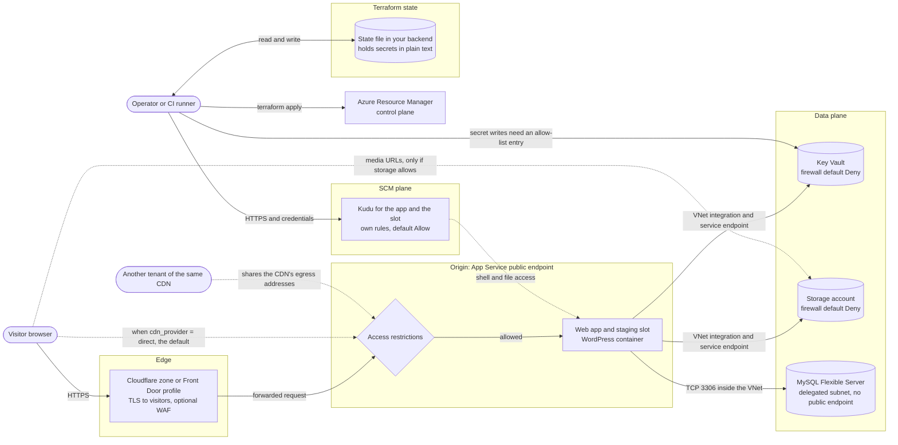
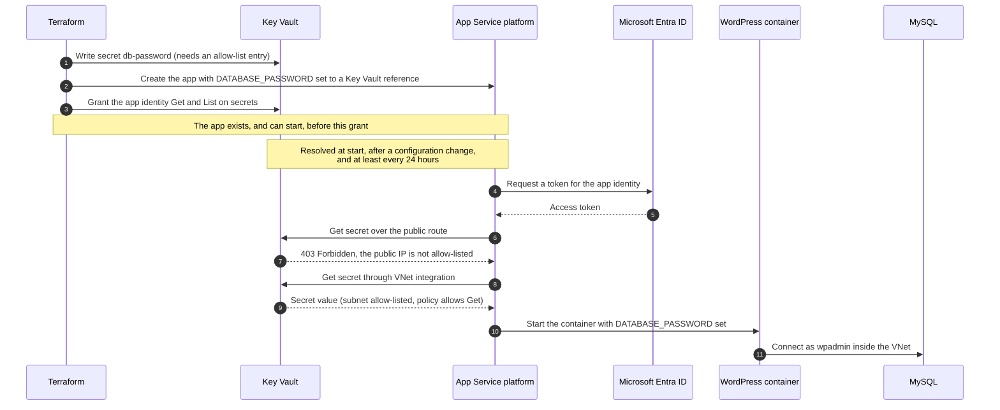

# Security model

This page explains what the `wordpress-site` module protects, where its trust boundaries
are, and what you must protect yourself. Read it before you deploy a site to production.

To report a vulnerability, see [SECURITY.md](../SECURITY.md). For the components, the request
flows and the network layout, see [Architecture](architecture.md). To deploy, start with
[Getting started](getting-started.md) and the [Deployment guide](deployment-guide.md).

> **Version.** This page describes v4.1.1. Every `file:line` reference points to commit
> [`9cf59db`](https://github.com/agenticcodingops/azure-wordpress/tree/9cf59dbf1f984a2e043cd7b6180187dda8cfcd5a).
> Line numbers can move in later releases. Where this page could not confirm a fact
> from the code or from vendor documentation, it says **UNKNOWN**.

## Contents

- [At a glance](#at-a-glance)
- [Trust boundaries](#trust-boundaries)
- [What the module enforces](#what-the-module-enforces)
- [What the module does not cover](#what-the-module-does-not-cover)
- [Terraform state holds generated secrets](#terraform-state-holds-generated-secrets)
- [Unknowns](#unknowns)
- [References](#references)

## At a glance

| Control | Default | You must act? |
| --- | --- | --- |
| Origin admits only the CDN | Off: `cdn_provider` defaults to `"direct"`, which admits everyone | Yes. Set `cdn_provider` |
| Key Vault data plane denies public access | On | Allow-list the deploying principal |
| Storage data plane denies public access | On | Set `Allow` if visitors load media from the blob endpoint |
| SCM (Kudu) restricted to an allow-list | Off: default action `Allow` | Yes. Set the SCM variables |
| FTP | Off at the transport layer | No |
| Basic-auth publishing credentials | On | Turn off if you can |
| Key Vault references resolved by managed identity | On | No |
| MySQL has no public endpoint | On | No |
| TLS required on MySQL connections | Off | See [Not covered](#mysql-connections-do-not-require-tls) |
| Terraform state protected | Not managed by the module | Yes. See [Terraform state](#terraform-state-holds-generated-secrets) |

## Trust boundaries

The module draws five boundaries. Each one has its own guard, and a guard on one does not
protect another.

| Boundary | What crosses it | What guards it |
| --- | --- | --- |
| Edge | Visitor requests | The CDN you choose. The module can add WAF rules on Front Door, and on Cloudflare when `enable_waf = true`. See [Edge](#edge). |
| Origin | Requests from the CDN to `app-<name>.azurewebsites.net` | App Service access restrictions on the app and the slot. See [Origin restricted to the CDN](#origin-restricted-to-the-cdn). |
| SCM plane | Kudu, deployment and SSH console traffic | A separate rule list, and authentication. See [SCM plane](#scm-plane). |
| Data plane | Secret reads, media reads and writes, database queries | Key Vault and Storage firewalls, the delegated MySQL subnet, and Key Vault access policies. See [Key Vault and Storage](#key-vault-and-storage-deny-public-access-by-default) and [Database network](#database-network). |
| Terraform state | Every attribute Terraform manages, secrets included | Your backend. The module does not manage it. See [Terraform state](#terraform-state-holds-generated-secrets). |

Azure Resource Manager (the control plane) sits outside all five. Key Vault and Storage
firewalls apply only to their data planes. Microsoft states that Key Vault control-plane
operations "are not affected by firewalls and virtual network rules"
([Key Vault service endpoints](https://learn.microsoft.com/en-us/azure/key-vault/general/overview-vnet-service-endpoints)).
The storage module notes the same for container management (`modules/storage/main.tf:34-37`).
Control-plane access is governed by Azure RBAC on the subscription, which you manage.

## What the module enforces

### Origin restricted to the CDN

The origin is restricted only when you choose a CDN. `cdn_provider` defaults to
`"direct"` (`modules/wordpress-site/variables.tf:324-333`). With `"direct"`, the
unmatched-rule action is `Allow`, so anyone can reach the app
(`modules/app-service/main.tf:258`).

**With `cdn_provider = "cloudflare"`**, the app and its staging slot each get:

- an allow rule for the Azure health probe address `168.63.129.16/32` at priority 10
  (`modules/app-service/main.tf:214-219`, slot `:368-373`);
- an allow rule for every Cloudflare IPv4 range (`modules/app-service/main.tf:222-230`, slot
  `:375-383`) and every IPv6 range (`:233-241`, slot `:385-393`);
- `Deny` for everything else (`modules/app-service/main.tf:258`, slot `:414`).

The ranges are read on every run from Cloudflare's published list
(`modules/wordpress-site/main.tf:52-54` and `:507-508`). A built-in list is the fallback
when the module is used on its own (`modules/app-service/main.tf:33-61`). These rules
depend only on `cdn_provider`. They apply even when `cloudflare.enabled` is `false` and the
module manages no Cloudflare resources (`modules/wordpress-site/main.tf:153`).

**With `cdn_provider = "azure_front_door"`**:

- The app and the slot allow the health probe address above and the
  `AzureFrontDoor.Backend` service tag, and deny the rest
  (`modules/app-service/main.tf:244-258`, slot `:401-414`).
- The service tag covers every Front Door instance, not only yours. A second step pins the
  main app to your instance: after Front Door exists, `azapi_update_resource` replaces the
  app's rule list with one rule that also requires your profile's GUID in the `X-Azure-FDID`
  header, followed by a deny-all rule (`modules/wordpress-site/main.tf:833-871`). This
  replacement list carries no health-probe rule.
- The staging slot does not get that header check. Any Front Door instance can reach it
  (`modules/app-service/main.tf:395-400`).
- Until the update resource has run, the main app's Front Door rule carries an empty
  header list (`modules/app-service/main.tf:252`, with `front_door_id` never passed in,
  `modules/wordpress-site/main.tf:499-502`). In that window it admits any Front Door
  instance, as the comment at `modules/wordpress-site/main.tf:831` warns.
- The web app resource manages the whole rule list and does not ignore changes to it
  (`modules/app-service/main.tf:316-326`). Whether a later apply removes the header check
  again is **UNKNOWN**; see [Unknowns](#unknowns).
- The origin rules follow `cdn_provider` alone (`modules/wordpress-site/main.tf:501`).
  Front Door itself, and the header update, also need `front_door.enabled`, which defaults
  to `true` (`modules/wordpress-site/main.tf:141`, `:776`, `:834`). With
  `cdn_provider = "azure_front_door"` and `front_door.enabled = false`, the app admits every
  Front Door instance and never gets the header check.

Microsoft documents the service-tag-plus-header pattern in
[Access restrictions](https://learn.microsoft.com/en-us/azure/app-service/overview-access-restrictions#restrict-access-to-a-specific-azure-front-door-instance).

Access restriction rules belong to the site, not to a host name. The rules above therefore
also govern requests to the default `*.azurewebsites.net` host name.

**The app-subnet network security group does not filter visitors.** The networking module
attaches an NSG with inbound rules to the App Service integration subnet
(`modules/networking/main.tf:86-134`, `:173-177`). Those inbound rules have no effect on
traffic to the app. Microsoft:

> "Routes don't apply to replies from inbound app requests and inbound rules in an NSG
> don't apply to your app. Virtual network integration affects only outbound traffic from
> your app. To control inbound traffic to your app, use the access restrictions feature or
> private endpoints."
> ([Virtual network integration](https://learn.microsoft.com/en-us/azure/app-service/overview-vnet-integration#network-routing))

The NSG declares no outbound rules, so Azure's default outbound rules apply: allow to the
virtual network, allow to the internet
([NSG default rules](https://learn.microsoft.com/en-us/azure/virtual-network/network-security-groups-overview#default-security-rules)).

### SCM plane

Kudu (the SCM site) is a separate gate from the rules above. The app and the slot each
have their own Kudu endpoint. Microsoft:
"The advanced tools site, which is also known as scm or kudu, has an individual rules
collection that you can configure"
([Access restrictions](https://learn.microsoft.com/en-us/azure/app-service/overview-access-restrictions#restrict-access-to-the-advanced-tools-site)).

What the module sets:

- **FTP is off at the transport layer.** `ftps_state = "Disabled"` on the app and the slot
  (`modules/app-service/main.tf:188`, `:358`).
- **The SCM rule list is yours to set, and it is empty by default.**
  `app_service_scm_ip_restrictions` defaults to `[]` and
  `app_service_scm_ip_restriction_default_action` to `"Allow"`
  (`modules/wordpress-site/variables.tf:218-254`). Both apply to the app and the slot
  (`modules/app-service/main.tf:270-283`, slot `:419-432`). With the defaults, Kudu is
  reachable from the internet and protected only by authentication.
- **Basic-auth publishing credentials are on by default.**
  `app_service_ftp_publish_basic_authentication_enabled` and
  `app_service_webdeploy_publish_basic_authentication_enabled` both default to `true`
  (`modules/wordpress-site/variables.tf:256-266`). Both apply to the app and the slot
  (`modules/app-service/main.tf:172-173`, `:342-343`).
- **SCM never inherits the main site's rules.** The module leaves
  `scm_use_main_ip_restriction` at its provider default, `false`
  (`modules/app-service/main.tf:263-266`). With a CDN set, inheriting would lock operators
  out of Kudu.

Hardening SCM is therefore opt-in. The
[app-service README](../modules/app-service/README.md#scmkudu-network-posture) and the site
module's [Hardening the SCM/Kudu endpoint](../modules/wordpress-site/README.md#hardening-the-scmkudu-endpoint)
explain how to restrict it without losing the SSH console, and
[Publishing Credentials](../modules/app-service/README.md#publishing-credentials) explains
what breaks when you turn basic auth off.

### Key Vault and Storage deny public access by default

**Key Vault.**

- The vault firewall denies by default. `network_acls.default_action` is `Deny` unless you
  set `key_vault_public_network_access_enabled = true`
  (`modules/key-vault/main.tf:54-59`; `modules/wordpress-site/variables.tf:130-134`).
- The site's App Service subnet is always allow-listed
  (`modules/wordpress-site/main.tf:419-422`). That subnet carries the `Microsoft.KeyVault`
  service endpoint (`modules/networking/main.tf:49-51`).
- `bypass = "AzureServices"` is set (`modules/key-vault/main.tf:55`). This does **not**
  admit App Service Key Vault references. Microsoft lists App Service as trusted "only for
  Deploying Azure Web App Certificate through Key Vault"
  ([trusted services](https://learn.microsoft.com/en-us/azure/key-vault/general/overview-vnet-service-endpoints#trusted-services)).
  References reach the vault through the allow-listed subnet instead. The code comment at
  `modules/key-vault/main.tf:50-51` says otherwise; the Microsoft table is the authority.
- Terraform is not a trusted service. Its secret writes need an entry in
  `key_vault_network_acls_ip_rules`, a runner subnet in
  `key_vault_network_acls_virtual_network_subnet_ids`, or public access turned on
  (`modules/wordpress-site/variables.tf:130-146`).
- The vault uses access policies, not Azure RBAC (`modules/key-vault/main.tf:45`).
- Purge protection is on in production and off in nonprod, unless you set it
  (`modules/wordpress-site/main.tf:113-116`).

**Storage.**

- The storage firewall denies by default.
  `storage_network_rules_default_action` defaults to `"Deny"`
  (`modules/wordpress-site/variables.tf:172-181`; `modules/storage/main.tf:38-43`).
- The App Service subnet is always allow-listed (`modules/wordpress-site/main.tf:363-366`).
  It carries the `Microsoft.Storage` service endpoint (`modules/networking/main.tf:45-47`).
- With `cdn_provider = "cloudflare"`, Cloudflare's IPv4 ranges are allow-listed too
  (`modules/wordpress-site/main.tf:359-362`).
- Anonymous public access to blobs is off for the whole account:
  `allow_nested_items_to_be_public = false` (`modules/storage/main.tf:28`). The uploads container is private
  (`modules/storage/main.tf:91`).
- Shared-key access stays on, because the WordPress storage plugin needs it
  (`modules/storage/main.tf:29`).
- Infrastructure (double) encryption is on (`modules/storage/main.tf:32`).
- The SAS expiry policy is 7 days with action `Log` (`modules/storage/main.tf:46-49`).
  With `Log`, "requests made with out-of-policy SAS are allowed"; they are only logged, and
  only if blob logs go to Azure Monitor
  ([SAS expiration policy](https://learn.microsoft.com/en-us/azure/storage/common/sas-expiration-policy#define-the-sas-expiration-action)).
  The policy does not limit the account key itself, which the storage plugin uses
  (`modules/app-service/main.tf:124`).

`Deny` breaks media for visitors when the plugin serves media straight from the blob
endpoint. Sites that do so must set `Allow`. The
[storage README](../modules/storage/README.md#network-rules) explains the choice.

### Database network

- MySQL Flexible Server runs with private access (VNet integration) in a subnet delegated
  to it (`modules/database/main.tf:64-66`; `modules/networking/main.tf:54-72`). Microsoft:
  a server "deployed to a virtual network can't have a public endpoint"
  ([MySQL private access](https://learn.microsoft.com/en-us/azure/mysql/flexible-server/concepts-networking-vnet#unsupported-virtual-network-scenarios)).
- Name resolution uses the private DNS zone `privatelink.mysql.database.azure.com`, linked to
  the site's virtual network (`modules/dns-zones/main.tf:7-27`).
- The database-subnet NSG allows TCP 3306 from the App Service subnet's address range and
  denies all other inbound traffic (`modules/networking/main.tf:137-171`, `:180-183`).
- This is **not** a private endpoint. The networking module creates a private-endpoint
  subnet (`modules/networking/main.tf:74-84`), but no module creates a private endpoint in
  it.
- The admin password is a 32-character random value (`modules/wordpress-site/main.tf:209-213`).

[Architecture: Network](architecture.md#network) has the full subnet and DNS layout.

### Managed identities resolve Key Vault references

The module stores three secrets of its own in the site's vault: `db-password`,
`storage-key` and `appinsights-connection` (`modules/wordpress-site/main.tf:377-381`).
Consumer secrets from `extra_secrets` are stored beside them, and cannot overwrite them
(`modules/wordpress-site/main.tf:427`).

By default, Terraform does not write these values into the app's settings. It writes Key
Vault references, which App Service resolves at run time:

- `DATABASE_PASSWORD` (`modules/app-service/main.tf:71`);
- `APPLICATIONINSIGHTS_CONNECTION_STRING` (`modules/app-service/main.tf:78`);
- `MICROSOFT_AZURE_ACCOUNT_KEY`, unless `app_service_storage_plugin_app_settings_enabled`
  is `false` (`modules/app-service/main.tf:120-126`);
- each entry of `extra_secret_app_settings` (`modules/wordpress-site/main.tf:443-446`).

These are defaults, not guarantees. `app_service.extra_app_settings`
(`modules/wordpress-site/variables.tf:285`) is merged after the module's own settings, so
an entry with the same name replaces a reference (`modules/app-service/main.tf:287`). On the
staging slot, `app_service.staging_app_settings_override` is merged last of all
(`modules/app-service/main.tf:436-440`). A literal secret passed through either input sits
in the app's configuration and in Terraform state. Use `extra_secrets` with
`extra_secret_app_settings` instead.

The app and the slot each have a system-assigned managed identity
(`modules/app-service/main.tf:179-181`, `:349-351`). Each identity gets `Get` and `List` on
secrets, and nothing else (`modules/wordpress-site/main.tf:531-545`, `:548-568`). The
deploying principal gets `Get`, `List`, `Set`, `Delete`, `Purge` and `Recover` on secrets
(`modules/key-vault/main.tf:87-101`).

[Architecture: Secrets](architecture.md#secrets) shows the same flow from Terraform's side,
including how the database password is created. The sequence follows Microsoft's
[Key Vault references](https://learn.microsoft.com/en-us/azure/app-service/app-service-key-vault-references)
and [virtual network integration](https://learn.microsoft.com/en-us/azure/app-service/overview-vnet-integration#app-settings-using-key-vault-references)
pages:

- References use the app's system-assigned identity by default.
- "App settings using Key Vault references attempt to get secrets over the public route.
  If the Key Vault is blocking public traffic and the app is using virtual network
  integration, an attempt is made to get the secrets through the virtual network
  integration." This is why the vault's audit log can show a 403 from the app's public IP
  followed by a success from its private IP; Microsoft calls this "by design".
- App Service "caches the values of the Key Vault references and refetches them every 24
  hours". A configuration change restarts the app and refetches at once.
- If a reference cannot be resolved, the app sees the literal `@Microsoft.KeyVault(...)`
  string instead of the secret.

The module grants the app's access only after the app exists: both access policies depend
on the app-service module (`modules/wordpress-site/main.tf:541-544`, `:564-567`), and the
key-vault module's own app policy is never created, because it receives a placeholder ID
(`modules/wordpress-site/main.tf:403`; `modules/key-vault/main.tf:73`). How soon the app
resolves its references after the grant is **UNKNOWN**; see [Unknowns](#unknowns).

### TLS settings

| Where | Setting | Code |
| --- | --- | --- |
| App Service, app and slot | HTTPS only | `modules/app-service/main.tf:165`, `:338` |
| App Service, app and slot | Minimum TLS 1.2 | `modules/app-service/main.tf:186`, `:356` |
| App Service, app and slot | FTP disabled | `modules/app-service/main.tf:188`, `:358` |
| Storage account | Minimum TLS 1.2, HTTPS only | `modules/storage/main.tf:26-27` |
| Front Door custom domain | Managed certificate, minimum TLS 1.2 | `modules/front-door/main.tf:78-81` |
| Front Door route | HTTPS to the origin, HTTP redirected to HTTPS | `modules/front-door/main.tf:93`, `:95` |
| Front Door origin | Certificate name check on | `modules/front-door/main.tf:69` |
| Cloudflare zone | `ssl = strict`, minimum TLS 1.2, Always Use HTTPS, **only when `cloudflare.enable_zone_setting_overrides = true`** | `modules/cloudflare/main.tf:134-158`; defaults `modules/cloudflare/variables.tf:68-72`, `:79-82`; off by default `modules/wordpress-site/variables.tf:347` |
| Cloudflare page rules | `ssl = strict` on `/wp-admin/*`, `/wp-login.php*` and `/wp-content/*`, **on by default** whenever `cdn_provider = "cloudflare"` and `cloudflare.enabled = true` (`cloudflare.enable_page_rules` defaults to `true`) | `modules/cloudflare/page-rules.tf:17-86`; default `modules/wordpress-site/variables.tf:345`; module gate `modules/wordpress-site/main.tf:153`, `:879` |
| MySQL | TLS **not** required: `require_secure_transport = OFF` | `modules/database/main.tf:91-96` |

The custom host-name binding on App Service has no certificate
(`modules/wordpress-site/main.tf:942-969`). Whether Full (strict) works end to end with that
binding is **UNKNOWN**; see [Unknowns](#unknowns). With the default page rules, that question
applies to the admin, login and content paths whatever the zone setting is.

### Edge

- **Front Door** (`cdn_provider = "azure_front_door"`): a WAF policy runs Microsoft's
  Default Rule Set 2.1 and Bot Manager 1.1 (`modules/front-door/main.tf:114-179`). It is in
  Prevention mode in production and Detection mode in nonprod, unless you set it
  (`modules/wordpress-site/main.tf:143`). Rules 942230 and 941320 are set to log only, and
  WordPress cookies are excluded, to avoid blocking the editor
  (`modules/front-door/main.tf:127-166`). The default SKU is Premium
  (`modules/wordpress-site/main.tf:142`).
- **Cloudflare** (`cdn_provider = "cloudflare"` and `cloudflare.enabled = true`): the
  module manages the site's DNS records and proxies the site's CNAME records unless you set
  `cloudflare.proxied = false` (`modules/wordpress-site/main.tf:153`;
  `modules/wordpress-site/variables.tf:343`; `modules/cloudflare/main.tf:48-126`). Page
  rules, on by default, bypass the cache and set `security_level = "high"` and
  `ssl = "strict"` on `/wp-admin/*` and `/wp-login.php*` (`modules/cloudflare/page-rules.tf:17-64`;
  `modules/wordpress-site/variables.tf:345`). With `cloudflare.enable_waf = true` (default `false`,
  `modules/wordpress-site/variables.tf:344`), the module adds custom block and challenge
  rules (`modules/cloudflare/waf.tf:131-181`) and rate limits on `/wp-login.php` and
  `/xmlrpc.php` (`modules/cloudflare/waf.tf:82-124`). It also adds skip rules in the
  managed-rules phase for admin paths and WordPress cookies
  (`modules/cloudflare/waf.tf:19-75`). It does not deploy any Cloudflare managed ruleset:
  no rule in `modules/cloudflare` uses the `execute` action.

## What the module does not cover

### Binding the origin to one CDN account

With Cloudflare, the origin admits Cloudflare's IP ranges. Those ranges are shared by every
Cloudflare customer, so the rules identify Cloudflare, not your zone. A request sent through
another Cloudflare account reaches your origin without passing your zone's WAF rules,
redirects or access policies. The module offers no request-header check for Cloudflare
today. An optional header filter is proposed in
[issue #64](https://github.com/agenticcodingops/azure-wordpress/issues/64).

With Front Door, the main app is bound to your profile by the `X-Azure-FDID` check. The
staging slot is not (see [Origin restricted to the CDN](#origin-restricted-to-the-cdn)).

### Protecting `/wp-admin`

The module puts no identity or access gate in front of `/wp-admin` or `/wp-login.php`.
WordPress's own login is the only authentication. The edge features that do touch those
paths are general, not an access control:

- the Front Door WAF policy covers every path (`modules/front-door/main.tf:186-198`);
- the Cloudflare page rules set `security_level = "high"` on both paths
  (`modules/cloudflare/page-rules.tf:29`, `:56`);
- with `enable_waf = true`, the Cloudflare rules rate-limit login POSTs
  (`modules/cloudflare/waf.tf:93-107`) and add skip rules for admin paths in the
  managed-rules phase (`modules/cloudflare/waf.tf:30-44`).

A pattern for adding an identity-aware proxy at the edge and a token check at the origin is
tracked in [issue #76](https://github.com/agenticcodingops/azure-wordpress/issues/76).

### WAF rules beyond what the CDN plan provides

The module configures the WAF features listed under [Edge](#edge) and nothing more. Managed
rule sets, bot management and rate limiting depend on your CDN plan:

- On Cloudflare, the rate-limit rules that `enable_waf` adds need a Business plan or higher.
  The login rule matches on the request method (`modules/cloudflare/waf.tf:101-104`), and
  Cloudflare's availability table lists the Method field in rate-limiting expressions from
  the Business plan upward
  ([rate limiting rules](https://developers.cloudflare.com/waf/rate-limiting-rules/)). The
  ruleset's two rules and 60-second periods (`modules/cloudflare/waf.tf:91-123`) fit within
  Pro's limits, but the Method field does not. The code comment that says Pro is enough
  (`modules/wordpress-site/main.tf:150-151`) is out of date.
- The module deploys no Cloudflare managed ruleset. If you deploy one yourself, check how
  it interacts with the skip rules above, which match on a cookie name that any client can
  send (`modules/cloudflare/waf.tf:51-55`).
- On Front Door, the WAF policy takes the profile's SKU (`modules/front-door/main.tf:117`).
  Microsoft's managed rule set and bot protection are available on the Premium tier, not
  on Standard
  ([tier comparison](https://learn.microsoft.com/en-us/azure/frontdoor/front-door-cdn-comparison#service-comparison)).
  Premium is the module's default (`modules/wordpress-site/main.tf:142`).

### SCM is open by default

See [SCM plane](#scm-plane). Until you set the SCM variables, Kudu for the app and the slot
is reachable from the internet and guarded by authentication alone.

### The default `cdn_provider` admits everyone

`cdn_provider = "direct"` is the default, and it sets no origin restriction. See
[Origin restricted to the CDN](#origin-restricted-to-the-cdn).

### MySQL connections do not require TLS

The module sets `require_secure_transport = OFF` (`modules/database/main.tf:91-96`). The code
comment gives two reasons: traffic inside the VNet is "already encrypted at the network
layer", and the container does not configure TLS for MySQL by default
(`modules/database/main.tf:88-90`). Neither reason is verified here. Both are **UNKNOWN**.

### WordPress connects as the server administrator

The MySQL administrator login is `wpadmin` (`modules/wordpress-site/main.tf:317-318`), and
WordPress connects with the same login (`modules/wordpress-site/main.tf:474`). The module
creates no lower-privilege database user.

### Storage CORS admits any origin

The blob service allows `GET`, `HEAD`, `PUT` and `OPTIONS` from any origin
(`modules/storage/main.tf:67-73`). The code comment says "Restricted by WAF", but direct
requests to the blob endpoint do not pass through a CDN WAF. Writes still need
authorization: the account key, a SAS token or a Microsoft Entra ID token.

### Secret rotation

The module has no rotation procedure. See the warning under
[Terraform state](#terraform-state-holds-generated-secrets) before you try to rotate the
database password.

## Terraform state holds generated secrets

Terraform writes every managed attribute to state, including secrets. HashiCorp: "If you are
developing with Terraform locally, Terraform stores your state in a plaintext file, which
includes any secret values you defined in your configuration"
([Manage sensitive data](https://developer.hashicorp.com/terraform/language/state/sensitive-data)).
Marking a variable `sensitive` hides it from CLI output only: "Terraform still stores the
values of sensitive variables in your state"
([Input variables](https://developer.hashicorp.com/terraform/language/values/variables)).

For each site, state holds at least:

- the MySQL admin password, as the `random_password` result
  (`modules/wordpress-site/main.tf:209-213`), as the server's `administrator_password`
  (`modules/database/main.tf:40`) and as the `db-password` Key Vault secret;
- the storage account key (`modules/wordpress-site/main.tf:379`;
  `modules/storage/outputs.tf:24-34`);
- the Application Insights connection string (`modules/wordpress-site/main.tf:380`);
- every `extra_secrets` value that reaches the vault
  (`modules/wordpress-site/variables.tf:808-813`). Each becomes a Key Vault secret resource
  (`modules/key-vault/main.tf:105-110`). An entry named like a module-owned secret is
  dropped by the merge (`modules/wordpress-site/main.tf:427`);
- the publishing credentials of the app and the slot. The azurerm provider exports a
  `site_credential` block on the web app, with "the Site Credentials Password used for
  publishing"
  ([linux_web_app](https://registry.terraform.io/providers/hashicorp/azurerm/latest/docs/resources/linux_web_app)).
  With basic auth on (the default, see [SCM plane](#scm-plane)), these open Kudu;
- the Log Analytics workspace's shared keys, when the module creates the workspace
  (`modules/wordpress-site/main.tf:260-270`), and the Application Insights instrumentation
  key (`modules/wordpress-site/main.tf:273-282`). The provider exports both as attributes
  ([log_analytics_workspace](https://registry.terraform.io/providers/hashicorp/azurerm/latest/docs/resources/log_analytics_workspace),
  [application_insights](https://registry.terraform.io/providers/hashicorp/azurerm/latest/docs/resources/application_insights)).

Plan files can hold the same values: HashiCorp says "Terraform state and plan files"
can contain sensitive values.

Anyone who can read your state can read these secrets, whatever the Key Vault firewall and
access policies say.

### How to protect state

The module does not configure a backend. Step 1 of the
[Deployment guide](deployment-guide.md#step-1-create-the-state-store) creates a state store
along these lines, with one container per environment, and
[Getting started](getting-started.md#the-configuration) shows the backend settings. The
principles:

1. **Store state remotely**, never in a local file or in version control. HashiCorp
   recommends storing state remotely, encrypting it at rest, limiting access and keeping
   audit logs ([Manage sensitive data](https://developer.hashicorp.com/terraform/language/state/sensitive-data)).
2. **Use the `azurerm` backend with Microsoft Entra ID authentication.** Set
   `use_azuread_auth = true`, and grant the deploying principal Storage Blob Data
   Contributor on the state container. HashiCorp marks both as recommended
   ([azurerm backend](https://developer.hashicorp.com/terraform/language/backend/azurerm)).
   The backend locks state with Azure Blob Storage's native capabilities.
3. **Restrict the state storage account** to the people and runners that deploy. Treat read
   access to state as read access to every site secret.
4. **Rely on Azure Storage encryption at rest.** It is on for every account and cannot be
   turned off
   ([Storage encryption](https://learn.microsoft.com/en-us/azure/storage/common/storage-service-encryption)).
5. **Turn on logging** for the state account, so you can see who read state.
6. **Treat saved plan files like state.** Do not upload them as public CI artifacts.

> **Do not rotate the database password by replacing `random_password.db`.** The server
> ignores password changes (`ignore_changes = [administrator_password]`,
> `modules/database/main.tf:80-83`). A new `random_password` result updates the
> `db-password` Key Vault secret, which the app reads, but not the server. WordPress would
> fail to connect as soon as the app refetches the secret. A tested rotation procedure is
> **UNKNOWN**: none exists yet.

## Unknowns

These could not be confirmed from the code or from vendor documentation:

1. Whether traffic between the app and MySQL is encrypted at the network layer, as the
   comment at `modules/database/main.tf:88-90` says.
2. Whether the WordPress container can use TLS for its MySQL connection if
   `require_secure_transport` were turned on.
3. Whether a later apply removes the `X-Azure-FDID` check, and for how long. The web app
   resource manages the whole rule list with no `ignore_changes`
   (`modules/app-service/main.tf:316-326`), and in the azurerm provider source `ip_restriction`
   is optional, not computed
   ([`IpRestrictionSchema`](https://github.com/hashicorp/terraform-provider-azurerm/blob/main/internal/services/appservice/helpers/shared_schema.go)). So the next plan may show drift and restore the rules without
   the header, until `azapi_update_resource` (`modules/wordpress-site/main.tf:833-871`) adds it
   back on a later apply. This has not been tested.
4. Whether Cloudflare's Full (strict) mode works end to end with the module's host-name
   binding, which carries no certificate (`modules/wordpress-site/main.tf:942-969`). The
   default page rules use it on the admin, login and content paths
   (`modules/cloudflare/page-rules.tf:30`, `:57`, `:79`).
5. What the Cloudflare skip rules achieve. A skip with `ruleset = "current"` skips the
   remaining rules of the ruleset it is in
   ([actions](https://developers.cloudflare.com/ruleset-engine/rules-language/actions/)).
   The module's managed-phase ruleset holds only skip rules
   (`modules/cloudflare/waf.tf:19-75`), so on its own it appears to skip nothing. How it
   interacts with a managed ruleset deployed outside Terraform is not known.
6. How soon a new app resolves its Key Vault references after the module grants its
   identity access, which happens after the app is created
   (`modules/wordpress-site/main.tf:541-544`).
7. A tested procedure for rotating the database password, the storage key or the
   Application Insights connection string.

## References

Microsoft:

- [App Service access restrictions](https://learn.microsoft.com/en-us/azure/app-service/overview-access-restrictions)
- [App Service virtual network integration](https://learn.microsoft.com/en-us/azure/app-service/overview-vnet-integration)
- [Use Key Vault references as app settings](https://learn.microsoft.com/en-us/azure/app-service/app-service-key-vault-references)
- [Virtual network service endpoints for Azure Key Vault](https://learn.microsoft.com/en-us/azure/key-vault/general/overview-vnet-service-endpoints)
- [Network security groups overview](https://learn.microsoft.com/en-us/azure/virtual-network/network-security-groups-overview)
- [Azure Database for MySQL private access](https://learn.microsoft.com/en-us/azure/mysql/flexible-server/concepts-networking-vnet)
- [Azure Storage encryption for data at rest](https://learn.microsoft.com/en-us/azure/storage/common/storage-service-encryption)
- [SAS expiration policy](https://learn.microsoft.com/en-us/azure/storage/common/sas-expiration-policy)
- [Azure Front Door tier comparison](https://learn.microsoft.com/en-us/azure/frontdoor/front-door-cdn-comparison)

Cloudflare:

- [Rate limiting rules](https://developers.cloudflare.com/waf/rate-limiting-rules/)
- [Rules language: actions](https://developers.cloudflare.com/ruleset-engine/rules-language/actions/)

HashiCorp:

- [Manage sensitive data in your configuration](https://developer.hashicorp.com/terraform/language/state/sensitive-data)
- [Input variables](https://developer.hashicorp.com/terraform/language/values/variables)
- [azurerm provider resources](https://registry.terraform.io/providers/hashicorp/azurerm/latest/docs):
  `linux_web_app`, `log_analytics_workspace`, `application_insights`
- [azurerm backend](https://developer.hashicorp.com/terraform/language/backend/azurerm)

This repository:

- [SECURITY.md](../SECURITY.md)
- [Architecture](architecture.md)
- [Getting started](getting-started.md)
- [Deployment guide](deployment-guide.md)
- [app-service module](../modules/app-service/README.md)
- [key-vault module](../modules/key-vault/README.md)
- [storage module](../modules/storage/README.md)
- [networking module](../modules/networking/README.md)
- [wordpress-site module](../modules/wordpress-site/README.md)
