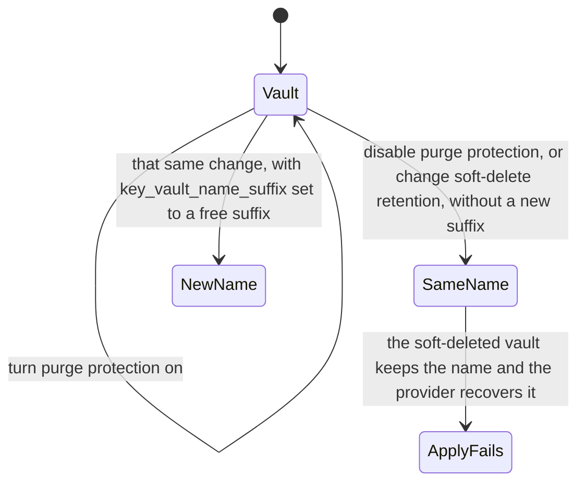

# v2 to v3

This page is **v3.0.0** (2026-08-02). v3.1.0 is on [v3 to v4](v3-to-v4.md), because the v4.0.0 changelog compares against v3.1.0.

## Expected plan

The v3.0.0 breaking change, in both [`CHANGELOG.md`](../../CHANGELOG.md) and the [v3.0.0 release notes](https://github.com/agenticcodingops/azure-wordpress/releases/tag/v3.0.0), says that leaving both new inputs unset on nonprod **destroys and recreates** the Key Vault. Azure permits enabling purge protection and does not permit disabling it, and `soft_delete_retention_days` cannot be updated after creation, so the only way to the new values is to replace the vault. The apply fails unless `key_vault_name_suffix` is bumped in the same change, because the soft-deleted vault still holds the name and the provider recovers it. The same bullet says production adopters are unaffected. Setting `key_vault_purge_protection_enabled = true` and `key_vault_soft_delete_retention_days = 90` keeps the previous behaviour.

The changelog upgrade path, which the release notes do not include, adds:

- Production, with neither new variable set: "Verified as an empty plan diff." Nothing to do. Nothing is replaced or destroyed.
- Option A (`true` and `90`): "No replacement, no plan diff."
- Option B sets a new `key_vault_name_suffix` in the same apply. The breaking change says that bump is what lets the replacement finish. The upgrade path says no secret value is lost and the database password is not rotated.
- "only *disabling* purge protection forces replacement." Turning it back on "is a free in-place update."

The release notes contain the breaking-change bullet and the purge-protection feature line. They do not contain the upgrade-path section, and they do not contain the `app_service_principal_id` line that the changelog has. They do not add a plan diff.

## Key Vault lifecycle

The diagram uses the v3.0.0 statements above and in the copied changelog entry. Purge protection can be turned on. Soft-delete retention is fixed at creation. Replacing the vault needs a new name suffix in that same apply.



## Changelog entry

Copied unchanged from [`CHANGELOG.md`](../../CHANGELOG.md). This change replaced that upgrade-path section, in the changelog, with a link to this page. The copy below is the section as it stood. Its link to the site-module README still names the old heading. That section is under [Moved from the site module](#moved-from-the-site-module).

## [3.0.0](https://github.com/agenticcodingops/azure-wordpress/compare/v2.0.0...v3.0.0) (2026-08-02)


### ⚠ BREAKING CHANGES

* **wordpress-site:** nonprod deployments that leave both new inputs unset get a Key Vault destroy-and-recreate. Azure permits enabling purge protection but never disabling it, and soft_delete_retention_days cannot be updated after creation, so Terraform can only reach the new values by replacing the vault. The apply fails unless key_vault_name_suffix is bumped in the same change, because the soft-deleted vault still holds the name and the provider recovers it rather than creating a new one. Set key_vault_purge_protection_enabled = true and key_vault_soft_delete_retention_days = 90 to keep the previous behaviour. Production consumers are unaffected.

### 🚑 Upgrade path — read before applying

**Production consumers who set neither new variable are unaffected** — the resolved values
are still `true` and `90`, exactly what the module hardcoded before. Verified as an empty
plan diff. Nothing to do.

**Nonprod deployments that leave both new inputs unset will replace their Key Vault, and
the apply fails if you do nothing.** Terraform destroys before it creates; the old vault
soft-deletes still holding its name, and because azurerm's `recover_soft_deleted_key_vaults`
defaults to `true`, the create step then *recovers that old vault* — with purge protection
still on, which the new configuration tries to disable. Azure refuses.

Pick one before upgrading:

```hcl
# A. Keep pre-v3.0.0 behaviour exactly. No replacement, no plan diff.
key_vault_purge_protection_enabled   = true
key_vault_soft_delete_retention_days = 90

# B. Adopt the new nonprod defaults, and give the new vault a free name in the same apply.
key_vault_name_suffix = "12"   # any value not already soft-deleted
```

Under option B no secret value is lost: `random_password.db` has no `keepers`, so the
database password is preserved and re-written into the new vault (**it is not rotated**);
`storage-key` and `appinsights-connection` are re-read from the untouched live resources;
`extra_secrets` are re-uploaded from your own configuration. Mind the 24-character vault
name limit, `kv-{site≤14}-{env}{suffix}`.

Note the asymmetry: only *disabling* purge protection forces replacement. Turning it back
**on** for a nonprod vault later is a free in-place update.

Full detail in [`modules/wordpress-site/README.md`](modules/wordpress-site/README.md#️-upgrading-to-v300--read-before-you-apply).

### Features

* **wordpress-site:** expose Key Vault purge protection and soft-delete retention ([#24](https://github.com/agenticcodingops/azure-wordpress/issues/24)) ([354bd9c](https://github.com/agenticcodingops/azure-wordpress/commit/354bd9c2b442614ddd3de8236970014d70fce66d))
* **wordpress-site:** expose `app_service_principal_id`, removing the need for a consumer to re-read the site with a `data "azurerm_linux_web_app"` block ([354bd9c](https://github.com/agenticcodingops/azure-wordpress/commit/354bd9c2b442614ddd3de8236970014d70fce66d))

## Moved from the site module

The wording below is the former section of `modules/wordpress-site/README.md`. Links that pointed at headings in that file, or at `docs/` from that file, now use a path from this directory.

## ⚠️ Upgrading to v3.0.0 — read before you apply

v3.0.0 makes Key Vault purge protection and soft-delete retention environment-aware.

**Production consumers who set neither new variable see no change at all** — the resolved
values are still `true` and `90`, exactly what the module hardcoded before.

**Nonprod deployments that leave both new inputs unset get a destroy-and-recreate of the
Key Vault.** The new defaults are `purge_protection_enabled = false` and
`soft_delete_retention_days = 7`, and neither can be reached in place on an existing vault:
Azure permits *enabling* purge protection but never disabling it, and the retention window
"can only be configured one time and cannot be updated". Terraform's only route to the new
values is to replace the vault.

Note the asymmetry — going the other way is free. Turning purge protection **on** for a
nonprod vault is an in-place update and needs no rebuild or suffix change.

### If you do nothing, the apply fails

Terraform destroys before it creates. The old vault soft-deletes still holding its name,
and because the azurerm provider's `recover_soft_deleted_key_vaults` feature defaults to
`true`, the create step then *recovers that old vault* rather than making a new one — with
purge protection still on, which the new configuration then tries to disable. Azure refuses.

Pick one before upgrading:

```hcl
# A. Keep pre-v3.0.0 behaviour exactly. No replacement, no plan diff.
key_vault_purge_protection_enabled   = true
key_vault_soft_delete_retention_days = 90

# B. Adopt the new nonprod defaults, and give the new vault a free name in the same apply.
key_vault_name_suffix = "12"   # any value not already soft-deleted
```

Under option B the replacement vault is repopulated in the same apply, and no secret value
is lost. `random_password.db` declares no `keepers`, so the existing database password is
preserved and simply re-written into the new vault — **it is not rotated**, and the copy
inside the soft-deleted vault stays valid until that vault is purged. `storage-key` and
`appinsights-connection` are re-read from the live Storage and App Insights resources,
which are not touched. Anything you pass through `extra_secrets` is re-uploaded from your
own configuration. The App Service's `@Microsoft.KeyVault(...)` references are rewritten to
the new vault automatically.

Note the 24-character vault-name limit — `kv-{site≤14}-{env}{suffix}` — when choosing a suffix.

### Why the default changed

A purge-protected vault that is soft-deleted locks its name for the full retention period
against **everyone**; `az keyvault purge` returns `MethodNotAllowed` even for a
subscription Owner. On an environment that is deliberately destroyed and rebuilt, that
turns every cycle into a code change. Turning purge protection off is what makes the name
immediately reusable — the provider's `purge_soft_delete_on_destroy` (default `true`) then
purges cleanly on destroy. The retention value is a secondary control.

Production keeps purge protection precisely because that irreversibility is the point.

